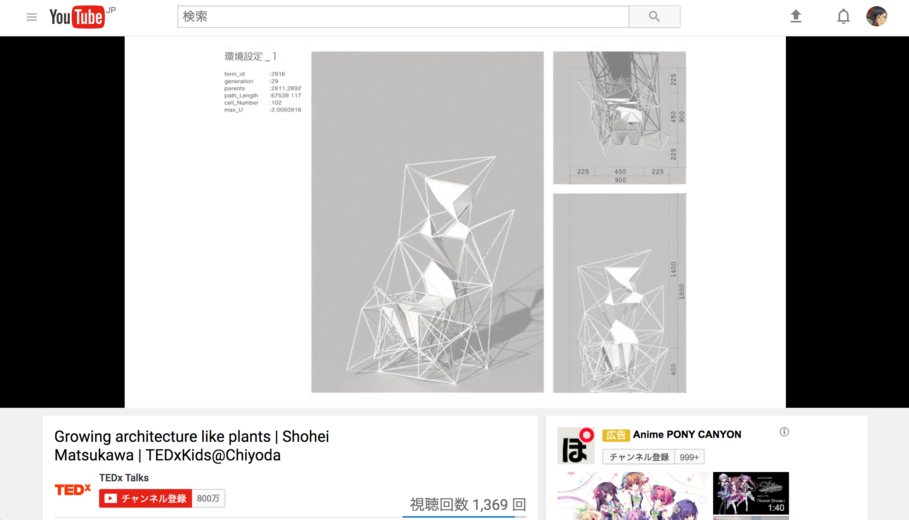
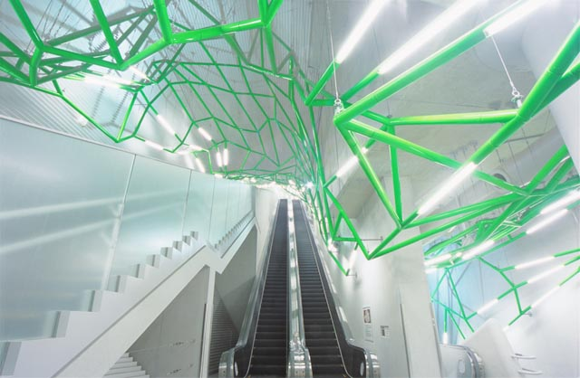
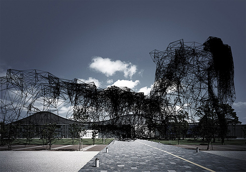

# 卒業論文 + 卒業制作について  

「アルゴリズムを用いた生成的な設計についての研究」  

---

### 卒論から卒制に向けた流れ  

*<-- ここから卒論 -->*  
  // 論文というよりも制作のためのステイトメントに近いのかもしれない  

  #### ジェネ系資料の洗い出し  
  - アルゴリズミック・デザイン （日本建築学会 編） // 今ここ  
  - Rhinoceros add-on Forum  
  - shape optimization tech by autodesk  

  #### 理論、アルゴリズムの検討  
  - グレッグ・リンのエッセイ // 読みにくい  
  - パラメトリシズム // 英語文献  

  - 「形の合成に関するノート」 クリストファー・アレクザンダー  
  - 「代謝建築論」 菊竹清訓  
  - 「Parametrisism」 Patrik Schumacher // [シューマッハのパラメトリシズム](http://www.archifuture-web.jp/magazine/126.html)  
  - 「アルゴリズミック・アーキテクチュア」 コスタス・テルジディス(著), 田中浩也(監訳)  

*<-- ここまで卒論 -->*  

&nbsp;

*<-- ここから卒制 -->*  
  #### 実装  
  - 先に起こったリサーチに基づき、 java か C++ で実装する  
  // 当初、Unity での C# 、Grasshopper　での Python も検討していた  

*<-- ここまで卒制 -->*  

&nbsp;  
&nbsp;  
## 先行研究として  
- ### アルゴリズミック・デザイン （日本建築学会 編）  
渡辺誠 など  

- ### any シリーズ  
磯崎新、ピーター・アイゼンマン、グレッグ・リン など  
// リンのエッセイが載っているのは、#5,6,7,8,9
- ### パラメトリシズム  
パトリックシューマッハ

&nbsp;  
&nbsp;  

##  ジェネ系資料の洗い出しより  
&nbsp;

- ##### アルゴリズミック・デザイン （日本建築学会 編）  
  - 渡辺誠  
    - 「アルゴリズミックデザイン」とは、要求される課題を解くためのアルゴリズムを用い、解答として形態や構成を生成する、設計手法である  
    - 「生成」とは、アルゴリズム→プログラムを通じて「間接的に」成果物を「生み出す」  
    - 検証可能性、計測可能性  
    - 目的をかなえるためには、どういう手順で何をしたらいいのか  
    - 生成 + 評価のフィードバック回路

  - 五十嵐太郎  
    - アルゴリズムは関数として表現される規範性を持つとともに、パラメータの入力によって多様な差異をもたらす(柄沢祐輔)  
    - アルゴリズム的思考は、モダンの規範性とポストモダンの求めた多様性をともに可能とする、全く新しい文化的なフェイズへと私たちを導く(柄沢祐輔)  
    - 磯崎新と佐々木睦朗のフラックス・ストラクチャーになると、生物と工学の融合として流動的な構造が語られる  

  - 渡辺誠  
    - 「アルゴリズミック・デザイン」の内容は、曖昧性なく説明できる
    - 多義的なことばも衒学的な表現も、文学的レトリックも必要ない。（中略）そうして裸に近くなった姿が、アルゴリズムの本体だ。  
    - 設計者は多義と比喩でおられた布をまとうことを好む。  

  - 実作
    - 「コーポラ」 double Negative Architecture  
      - 工法・構造上の条件を満たし、変化のある壁面家具  
      - 施工上の可能範囲、強度上の可能な範囲  
      - 極座標系の空間表記法（Super eye）  

      
&nbsp;
&nbsp;

    - 「神奈川工科大学 KAIT工房」 石上純也  
      - 柱の角度分布のグラフ表示や、3D表記。その結果を渡し、構造計算を行い、その結果を表示する。  
      - 恣意性と偶然性と合理性を、あるバランスで兼ね備えた建築を作れる可能性を示す。  

      
&nbsp;
&nbsp;

    - 「台中メトロポリタンオペラハウス」 伊東豊雄  
      - 直交グリッドをもとにしながら、その整形性の制約を超える空間形態を目指す。（ゲント同様）  
      - 3次元グリッド内での、指定条件に適合した滑らかな曲面形態（空間）の決定  
      - 生成する曲面は自由曲面ではなくカテノイドとすることで、全体形態に自由度とともに一貫性を与えている。  

      

&nbsp;
&nbsp;

- ##### Rhinoceros add-on Forum  
  - [kangaroo (physic sim)](http://www.grasshopper3d.com/group/kangaroo)  
    - hoge
  - [millipdede (optimization)](http://www.grasshopper3d.com/group/millipede)  
    - hoge
- ##### shape optimization tech by autodesk  
  - [what is](https://www.autodesk.com/solutions/generative-design)  
    - Fusion360による解析及び最適化  
      
    

&nbsp;

## 理論、アルゴリズムの検討
- ##### any シリーズ  
  - 形態と領域 （リン #5）  
    - バロック、ライプニッツ、襞 // これについては西洋哲学史（熊野純彦）に詳しいとのこと飯島先生より  
    - ジェネレーションX、サイバーカルチャ  
    - コンピュータのよる新しい媒体、マテリアル  
      - モデリングクレイ // いわゆるZbrush系  
      - リキッドメタル // いわゆる流体  
      - パーティクルクラウズ // いわゆる群、のちにSwarm  
    - 生命の躍動性は、時間軸にのる  
    - カント的な、部分と全体  
    - ニュータウンは、米英仏独etc...どれも同じ  
    - 多様性  
      - 特異、新奇ではなく、差異化された連続的な列  
    - 器官主義
      - 差異の生成  
      - 非ダーウィン的ネットワーク、内的束縛  
      - 成長と形態（ダーミー・トムソン 1917）  
        - 海老のグリッドの変化により、環境とその個体の対応を示した  
        - 同様なことは鳥にも言える  
    - 均衡と安定  
    - 粒子モデリング  
      - アトラクタ、力により、全システムが変形。流状媒体  
    - 回避すべき2点  
      - メカニズムと反復  
      - 単一組織  
    - 局所では差異化、つまり建築では個別化、全体つまり都市では連続  

  - 身体から流状体へ （リン #6）  
    - 動的で多様な変化に富んだ身体、組織化されたシステムとしての身体  
    - 連続性と永続性  
    - 生命主義（ライプニッツ、ベルクソン、ホワイドヘッド、ドゥルーズ）  
    - 3つの身体  
      - 閉じて固定された秩序の身体  
        - 正確(正解と厳格)  
        - 反復可能な同一体  
      - 秩序に開かれ進化する身体  
        - 無正確な厳格さ(無正確と厳格)  
        - 変化しない同一性  
      - 秩序を持たないそれ自身によって広がる身体  
        - 不正確  
        - 記述しえない同一性  
    - 閉じたプロポーション、開いた組織  
    - 他部の情報を折り畳み、内部で動的に押し広げる  
    - 流状体  
      - 同一性から差異性へ  
    - パラメータは単に形や質量を決めるのではなく、形を決める要素として利用  
    - コンピュータは、批評的洞察にたいしての抵抗である  
    - 3つの様態  
      - 可変的な表面  
      - パラメータの強制  
      - 時間上の進展  
    - 可変的、内的な多様性、動きを持つ個体  
    - 建築家は直立不動な構造体、垂直性、均衡を好む  
    - 骨組み（運動学）と、流状体（多次元表面）  
    - 単独でありながら連続、多様かつ非連続  
    - 有機体とは、複雑な機械的関係。それは集合体的な全体の変化と、局所的な異質性。  

  - 時の幾何学 （リン #7）  
  - バイオ・タイム （リン #8）  
  - サーフェイスの効果 （リン #9）  

- ##### Parametrism  
  - hogehoge  

## メモ  
- 「ネットワーク・プラクティス」山口隆  
- 設計の設計、メタ設計  
- 内在する潜在するアーキテクチャ  
- 建築も全体を構成しているも含めて、1つのネットワーク的な構造
- どんな設計も、 io における差異でしかなく、アーキテクチャは単一  
-   

*170705*  

### 自分が影響を受けた作品について  

##### Orishiki-controller  

スライダーのアプリケーション  
パラメトリックデザイン  
  

&nbsp;  

##### Embryological House （Greg Lynn）  
流状体的な家  
変体する形態のどの瞬間でも家に変換できる  
変換のルールが設計されている  
  

### コンピュータについて考えたい理由  

ヴェクターワークスは、手のパワーアップでしかないこと  
脳みそのパワーアップをしたい、もう少しインテリジェンス  
ソフトの設計思想や、仕様くせに縛られるという面も大きい  

絵描き歌は、共通認識の要素のパラメータを省略しているため、元の絵を知らない人は描けない。  
元の絵を知らない人に向けての絵描き歌は、すべての要素の洗い出しが必要  

### コンピュータの位置づけ  
恣意性について  
恣意性を取らないコンピューティングか  
コンピュータを動かす時点で（コマンドを出す時点で、コードを組む時点で）、一定の恣意性は挟まれる。  

恣意性の扱い方について幾つかのフェイズがある

##### 完全なるジェネラティブ系  
autodesk の構造最適化  
google の検索ランクづけや、画像認識、そして alpha碁  
このあたりは、ブラックボックスに見える（正確には違うところもある）

##### 巨大なブラックボックスとかしている人工知能について  
最近の将棋の電王戦  
人虎知能 Ponanza の、1手目が将棋の常識的に考えるとありえない、理解不能  

##### カレー  
自分の食べたい理想美味しさのカレーを作るコンピュータがあるとして...  
例えばそれが実家のカレーである時に、  

- コンピュータが君が食べたいカレーはこれだよと、美味しさの面では実家のものを超越している未知のカレーを出してくるかもしれない  
  - ブラックボックス的に何かが決められている気持ち悪さ  
  - これは不快

- 自分のイメージする実家のカレー  
  - こっち  
  - 自分の感性は保持していてほしい  

##### 作家ごとの違い  
double Negative Architectureと、  
松川昌平のコンピューティングと、  
渡辺誠のコンピューティングの違い  

##### Poetic Computing  
コンピュータへの逆の流れとして？  
[Zach Lieberman](https://twitter.com/zachlieberman)  

### 製造のリアルさ  
3D プリンタのサポート材（対重力）や、NC 加工機の2.5次元までという制限  
リンの家は、曲面コンクリに、曲面のガラスで、製造という面は考慮されていない  
リアルな製造は簡単かと思いきや、とても難しい。製造からの逃げ。

### 参考図書

##### 形の合成に関するノート  
クリストファーアレクザンダー（著）  

家庭用品のデザイン（性能 / ジョイント / 単純 / 費用）  

##### アルゴリズミック・アーキテクチュア  
コスタス・テルジディス(著), 田中浩也(監訳)  

コンピュータリゼーションとコンピューティング  
手のパワーアップと脳のパワーアップ  

##### 人工知能はどのようにして 「名人」を超えたのか? -最強の将棋AIポナンザの開発者が教える機械学習・深層学習・強化学習の本質  
山本一成（著）  

起こりうる局面、可能性を計算する  
チェスと将棋は記述可能で、囲碁になると記述不可能  

*170712*  

### 前回より
恣意性など

> また最近の将棋の電王戦
人虎知能 Ponanza の、1手目が将棋の常識的に考えるとありえない、理解不能  

TED等で見ると、松川昌平は、多分、気持ち悪いとかそういうものではなくて、ルールに則ったもの良しとしているように思える。  

##### 松川昌平の椅子  
かかる力や、施工の簡略さなどのルールのもと遺伝的アルゴリズム  
  
[松川昌平の TED のリンク](https://www.youtube.com/watch?v=tUaNzc2Ht4g)  

#### double Negative Architecture のアルゴリズミックウォール  
SuperEye という、360度の視野を持つ眼の群を用いている  
施工可能性などを評価関数としてとる  
  

&nbsp;  
&nbsp;  

それとは違って、いわゆるジェネ系の何らかを作っている人たちは、  
まず気持ち良いものを作ろうとプログラムを書く上で考慮しているように思う。  

##### 渡辺誠の飯田橋駅  
誘導都市という概念  
>
誘導都市の基本的な構造は、おおむね次のようになっている。（これとは違うタイプのものもあるが）  
１－「価値基準」  
２－「評価プログラム」  
３－「発生プログラム」  
４－「接続」  
５－「生成」  

  

  
[渡辺誠による設計意図の説明](http://www.makoto-architect.com/subway/subway_Ja3.html)  

### 恣意性や、建築設計とアルゴリズムの関係について貰ったヒント  

>単純に評価関数の有無と質の違いなのかな~と思う。  
将棋は「有限確定完全情報ゲーム」だから、評価関数のフレームが明示的で限定されている。  
建築は経済合理性・形状合理性とかはたぶん評価関数化できていると思うけど、  
美醜の評価式がまだ完成していないから、  
「気持ち悪い」だけで、美醜も関数化して、他パラメータと合わせて最適化するようにすれば解決しそうな気が

目指すべきゴール  
- 合理化、最適化  
- 美  

クリストファーアレクザンダーは、家庭用品のデザイン（性能 / ジョイント / 単純 / 費用）で決まると言った  

幾つかの評価軸の取り方  
制作に対する立ち位置  

&nbsp;  
&nbsp;  

*170719*  

### 関連する作品、研究  

##### Corpora in Si(gh)te  
double Negatives Architecture  
2007  
YCAM  
[http://special.ycam.jp/corpora/index.html](http://special.ycam.jp/corpora/index.html)

>「Corpora in Si(gh)te」では、YCAMを中心とした敷地全域 [館内、中央公園] に、多数のセンサーを付設したメッシュネットワークを形成し、リアルタイムの環境情報 [気温、明るさ、風向、音・ノイズetc.] を広範囲に収集・集積していきます。そのデータ解析をもとに、特殊な結節法則によって構造化される不可視の建築が、リアルタイムプロセッシングによって、館内・野外に生体のように成長または減退しながら生成されていくというプロジェクトです。  

センシングされた複数の情報群から、設計されたルールに基づいて構造物を生成される  
設計された対象は、ルールである  

>生成ルール  
Corporaの生成ルールは、セルラオートマトン、ライフゲームなどの方法や思考をベースにしています。構造結節点は、各環境情報 (風に対する抵抗による方向、温度の高低による高さ方向の角度、明るさによる平面的な広がり、音・ノイズの大小による存在確立) によって変化させています。 同時に周囲との構造結節点を捉え、過密、過疎、自立の可能／不可などのケースを局所的に分析・判断し、部分が自己複製を行ったり、反対に自滅したりします。

  

これは、現実空間から、仮想空間への一方通行である。  
また、渡辺誠と違い、最終的な絵がメインではないように見える。  

>ある建築がある、それを見て人間は振る舞いを決める。  
これが一般的である  
しかし、このプロジェクトでは、人間の振る舞いを見て、建築ができている。  
つまり逆。  
そして、元来、建築は、設計の過程で考え尽くしたとしても、建築物ができれば、使う人間が使い方を模索し、場合によっては新しい使い方を見つけてしまうものだ。  
(橋本)

#### SEMI-SENSELESS DRAWING MODULES  
yang02  
2014  
札幌芸術祭  
[http://yang02.com/works/sdm/](http://yang02.com/works/sdm/)  

センシングされたデータに干渉されるドローイングマシン  

現実空間をセンシングし、情報空間で処理しドローイング、そのドローイングの様子を見る人間をセンシングする、これがくりかえされる  

現実空間と情報空間のフィードバックループする構造となっている  

>復数のモジュールがレールを左右に移動し、吊るされたペンが巻取り機によって上下運動を行い、壁面に抽象的な線を描画していく。レール上でモジュール同士が衝突すると、お互いそれまでとは逆方向に動き出す。上下の可動範囲は展示空間の人の多さや騒音量、その日の気温、湿度といった環境のコンディションによって、時間と共にゆるやかに変化していく。そうして描画機たちが自らが置かれる場と関係性を持ちながら、長い時間をかけて一つの巨大な抽象画を生成する。 抽象表現主義の多くの画家たちは自身の感情を表現し、行為の痕跡をキャンバスに定着させたと言われている。本作では環境の変化が画家の内面性に働きかけ、描く絵の質に影響を与えるとし、外界の状況をマシンの動き方に反映させることで、抽象画家そのものをシュミレートすることを試みた。画家の感情を左右する要因を取り入れることで、マシンによる表現はより豊かになりえるのだろうか。  
共同制作者：菅野 創

---
### メモ  

##### Computer Aided（？） Design  
アプリケーションのコードを書いたり読んだりしていると、 CAD のアプリケーションの方が上に来ているのではないかな、と思ったりする  

したい設計がまずあって、それを CAD で図面を書くはずなのに、 CAD で書ける設計をしざるを得ない的な、ヴェクターワークスでゲーリーは書けない。  

このあたりもコンピューティングのあり方として考えるところがある。  

  

##### 長坂常の銀座 Loft
DUS Architects による 3D プリント什器  

DUS Architects  
[http://houseofdus.com/](http://houseofdus.com/)  

一般的には3D プリント特有の積層痕を消す処理を施すことが多いが、積層痕があってもそれを無しとしないデザインであるようだ  

  

##### 研究の新規性の見つけ方  
（[http://d.hatena.ne.jp/fukudakitchou/touch/20091126/1259243560](http://d.hatena.ne.jp/fukudakitchou/touch/20091126/1259243560)）  
>研究の新規性は、大きく四つに分けられる。  
１．手法が新しい  
工学系の研究では、最も一般的な新規性の出し方。  
例えばN先生の過去の論文であれば、ゲーム理論とマルチエージェントシミュレーション、実験経済学のアプローチを統合的に用いて分析する、という手法自体が新しいということ。  
２．対象が新しい  
手法は全く新しくないが、それを適用する対象が新しいということ。つまり、既存の手法を新しい対象に適用している点で、新規性がある。  
３．結果が新しい  
手法も対象も一緒だが、結果が新しいということ。過去の結果を否定することで、新規性が出せる。  
４．解釈が新しい  
手法も対象も結果も一緒だが、その解釈が新しいということ。社会科学や人文科学の論文に多い。  

##### 山形浩生
伽藍とバザール等、山形浩生が訳したのテクストをいくつか読んだ  

