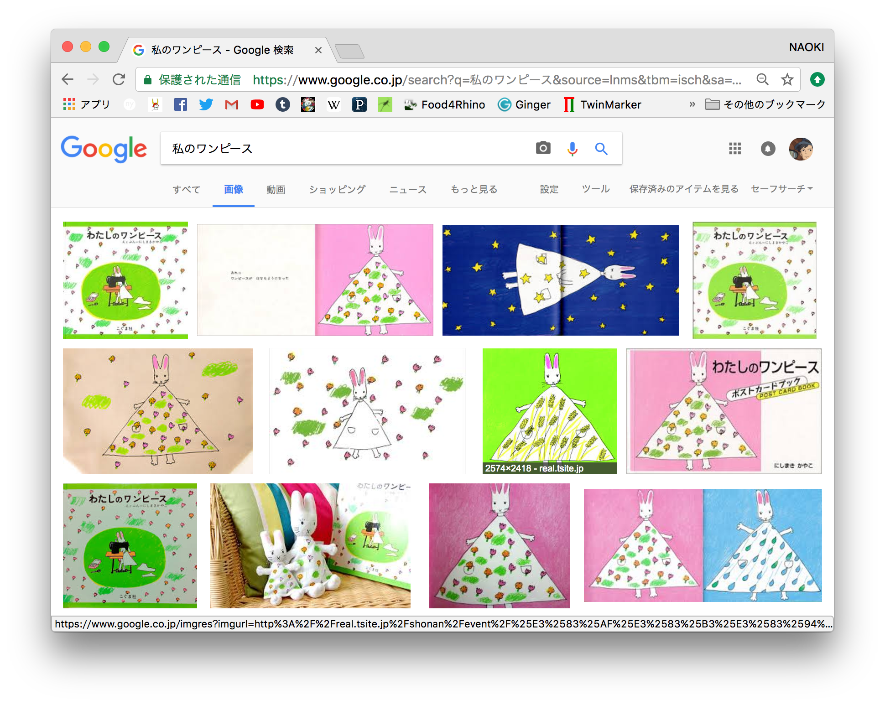
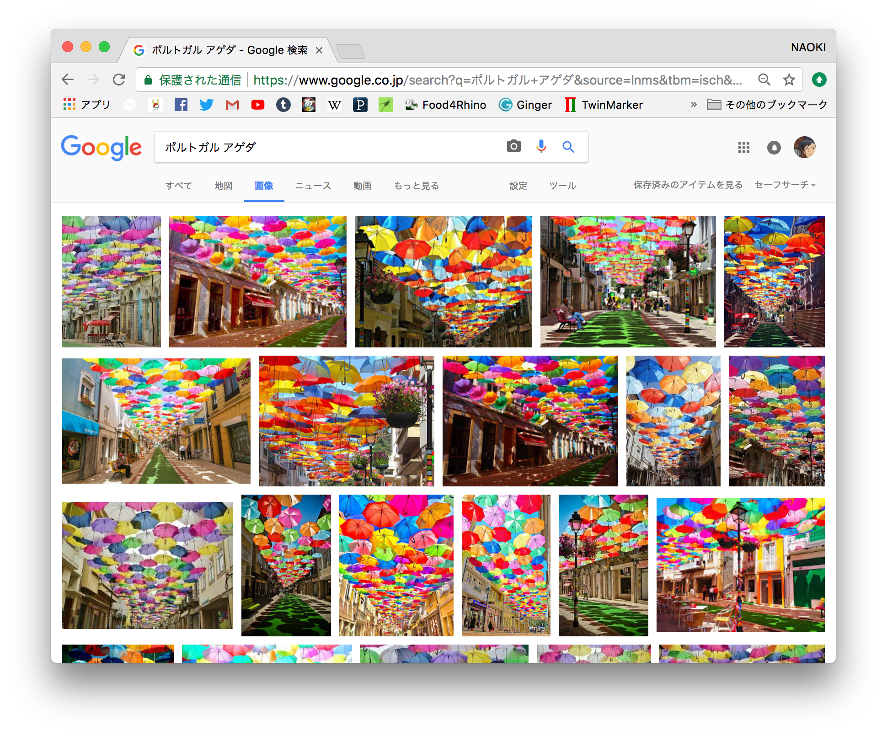

20世紀コンピュータアート  
170721と同様

### ハシモトゼミ  

##### MN  

空と雲の連作  

連作のそれぞれの絵の時刻、時間軸的な関係  

油画の下地、発色をよくする  

木製パネルやカンバスの側面の処理、絵画の溶けだし  

##### MF  

アイドルそのものでは無い  

1. 設計はしたく無いので、インスタレーション  
1. 興味があるのはダンスとアイドル  
1. 客観性、"自分を映す歪んだ鏡"  
1. 卒制とは、単位のためなので、大変そうなのはNG  

結果、インスタレーション  

アイドルなどの複数の分析を進めた結果、それをまとめるのは大変  
最初に考えた一つに戻す  
歪んだ鏡 = コンプレックス  
アイドル = 憧れ  

コンプレックス / 対比  

##### MH  

定まっていないものの良さ、固定されていないものの良さ  

壁は硬い  

花畑にはダイブしたい  

スノードームをひっっくりかえしたひらひら  

触ると毛並みが変わるカーペット  

わたしのワンピースの絵本  
  

傘のインスタレーション、ポルトガルのアゲタ  
  

女子大生のインスタグラム  
流行り、美術がわかる私、インスタ映え  

川越の氷川神社  

目の北アルプスの民家  
ファンタジー感  

サンリオピュローランドはインスタのおかげで儲かっている  
屋内、青いカレー、ディズニーよりも安い、天気関係無い  

##### KS （飛び入り）  

学生寮、学生と混ざった街  

横浜、新高島駅の更地  

学生寮 x 公共施設 = テーマパーク的な、楽しい街  
学校ミックス、高校大学  
美術教育、人間教育  

それに加えて、老人ホーム  
宮崎駿  

幼稚園児のお散歩  

開かれている / 開かれていない  

森をトンネルを抜けるとそこは別世界  

キャナルシティ、中野ブロードウェイ、県営河原町団地（[東京Deep案内](http://tokyodeep.info/kawasaki-kawaramachi-danchi/)）  

##### AH（飛び入り）  

福祉用品のセレクトショップ  

晴海の病院