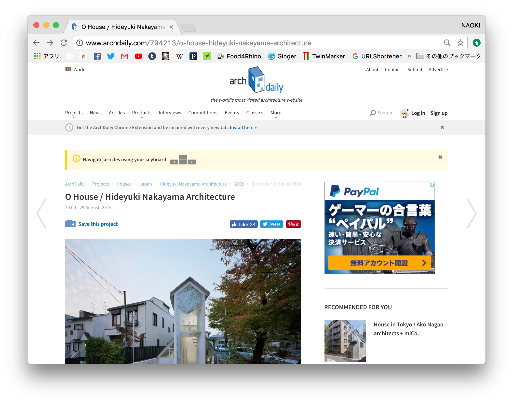

**「人類の台頭はいかにして起こったか？」**  
*ユヴァル・ノア・ハラリ の TED*  

著作  
1. サピエンス全史  
1. Homo Deus  

7万年の人類史、ホモサピエンスの歴史  

7万年前の段階では、人類、クラゲ、きつつき。どれも同じような程度であった。  
そこから、人類はいかにして特別な存在になりえたのか  
特別な存在 = 地球の支配者  

1人の人間 / 1匹のチンパンジー  
個々で比べると大して変わらない  

人間の集団 / チンパンジーの集団  
ここで、集団での柔軟性や、社会性を持ち協働することで差が出る  

さらに、柔軟性について考えてみる  
ミツバチの巣では、1つのルールで成り立っているが、
そのルールでは対応できない非常時には打ち負けてしまう  

また、社会性についてでは  
イルカや、狼、象、チンパンジーも集団で行動することが知られている  
しかし、ここでの集団は、少数（10〜100など）であり、全くの他者とは協働できない  

この、柔軟に、そして不特定多数での協働ができたのがホモサピエンスである  
カオスのような状態にならない  
効率的な協働  
互いに知らない者同士の協働  

人類は、負の歴史でも協働してきた（大虐殺や、強制収容所）  

協働できる理由はなんだろうか、それは **フィクション（虚構、想像）** である  
架空のストーリーを作り、それに価値を見出すことができる  
そこで使われるのは言葉だ  

チンパンジーは、バナナなど目に見える物体しか認識できない  

フィクションについて、まずあげるべきは宗教  
目に見えないものを信じている  

そして、人権、国家、お金、これらもフィクションである  
cf.  
山というものは実在するが、国家というものは実在しない  
お金とは、客観的、物体としては、無価値なものであるが、  
フィクションによる強いストーリーのもと、すべての人が価値を認識できる  
ストーリーがなければ、紙幣はただの紙切れ  

##### 客観的実在  
実在に依存している、動物はこれ  

##### フィクションの上での実在  
人間は客観的な実在に加えて、こちらの段階でものを見ることができる  

___

**170812 AI美学芸術研究会**  
*松田卓也のセッション*  

ユヴァル・ノア・ハラリという歴史家  

人類史の4つの革命  
1. 農業革命  
1. 産業革命  
1. 認知革命  
1. シンギュラリティ  

虚構を信じる力、ホモサピエンスのみ  

実在 / 虚構  

シンギュラリティの3つの可能性  
1. ユートピア  
1. 現実的シナリオ  
1. ディストピア  

// ハラリのHomo Deusのほうでは、無価値で用無しの人間が生まれると予想されている  

___

### 中山英之のO邸 の形態  

  

  

[(archdaily への記事へジャンプ)](http://www.archdaily.com/794213/o-house-hideyuki-nakayama-architecture)  

**O House の構成**  
  四角い平面に切妻と、丸い平面に切妻の屋根を丸めてしまうかたちでおさめる  
  また、立面のプロポーションはどう考えても普通では無い  

  これについて、中山が天才であると言えるのかもしれないが  
  部分部に分解してみると、  
  一般的な部分の組み合わせや、一般的な部分のパラメータの誇張としてたら得ることができる  

  天才でである（ひとまずここではそうする）中山のこの造形を  
  自分が設計システムを作るとして追いかけることはできるのだろうか  

**階層構造**  

  設計システムとしては、簡単に言ってしまうと、  
  階層構造を持った場合分けである  

  場合分けをする際の、その場合分けの順番が恣意性となる  

**階層に対しての、タグクラウドやセミラティス**  

  階層によってかかってしまう制限があるように思える  
  それに対して、どうしてなのかよくわからないが良さそうというものもある  
  その時、ストックされた記憶から何かがピックアップされている  

**何万枚の画像をストックした google photo = スーパースクラップブック**  

  cf Adobe Stock のイメージ検索のCM  

  "Water" "Stairs" などの具体的な物の名前や、  
  "Happy" "Cool" のようなキーワードでも検索できる  

  自分が良いと思ったものを大量にストックしておけば、  
  自分が良いものの中で、頭の何処かに行ってしまったものも含めて、  
  イメージに沿ったものを検索できる  

**学習 or ストック**  

  *学習*  
  ネット上のエロサイトをひたすらクロールして、  
  ピンク色のRGBや、キャッチコピーを学習すると最強のエロサイトができる  
  業者がOKを出している = 一定の魅力がある（他者に担保されている）  

  *ストック*  
  自分が良いと思ったものの組み合わせである  
  自分が良いと思ったものの集合体 = 自分が良いと思える（自分に担保されている）  

**ストックとその意味のなさ**  

  階層構造は、意味づけである。後付けでの意味づけである  
  逆に、 ストックは意味づけは特にしない  

  そのため、普通ありえないなと考え、  
  無意識のうちに捨てている可能性や  
  違和感でという、既成概念として排除している可能性を回収できる（可能性がある）

  意味づけは、ハラリの言葉を借りれば、フィクションである  
  ハラリの、ここから先の未来のデータイズムは、  
  意味を超えた何かということでいうと、無作為のストックの力である  

**まとめ**  

階層構造の持つものとして整理したいという気持ちと、  
階層構造なんてものはなくてもっと複雑にネットワーク的に、  
絡み合ったなにかで成立しているのだろうという気持ちがある。  

中山英之の家を見ると  
なんでかわからないが、心地よいと思えて僕には絶対できないのだろうなと思った。  

___

### ハシモトゼミ  

##### MN  

絵画とそれが置かれる環境の関係性  

1. 曖昧、ぼかし、暗闇  
  - 輪郭が見えない  
  - 形を認識させない  

1. 地平線に、トリックアート  
  - ある一点からのみ見れる
  - 2D、2.5D  

1. にじみでる、絵から流れ出す世界  
  - カンバスの外  
  - フレーム問題  

もっと3D空間的に角度や、位置関係の可能性  

物理的なポジショニングの可能性とともに、  
もっと他の軸がある  

特定のホワイトキューブではなく、生活動線の中  
時間軸や空間軸、身体性  

絵画の指向性  
屋外彫刻と、屋外に置かれた絵画

