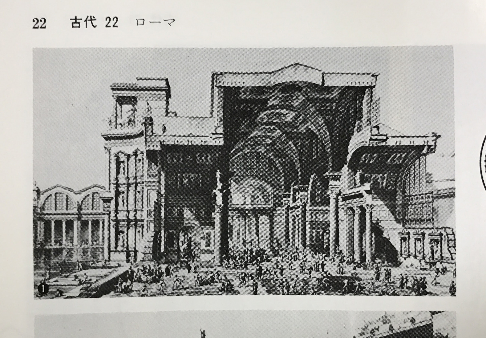

**Homo Deus**  
*ユヴァル・ノア・ハラリ の DVD*  

「サピエンス全史」  
人類史の過去7万年、人類が過去に可能にしたこと  
メタヒストリー  
地球の支配者になれた理由  
フィクション、虚構の力（神、国家、お金）  

「Homo Deus」  
人類の未来  
フィクションの力に、科学技術  
（ビッグデータ、人口知能）

現在、台頭する巨大な力  
テクノロジーデータ  

地質学的には、現在は完新世  
そろそろ、ポスト完新世、人新世へ  

**20世紀**  

3つの課題がありそれは、政治や経済、科学で解決できた  
（飢餓、疫病、戦争）  

**21世紀**  

飢餓 < 過食  
（それぞれ年間死者、100万と、300万）  

感染症 < 老衰  

戦争テロ暴力 < 自殺  

アルカイダや、 IS よりも、マクドナルドやコカコーラの方が危険  

これは、統計。データ

**これからの人類**

自然との戦いには勝利  
そのあとを生きる私たち人類の行うべきプロジェクトは  

人間から神、Homo Deus へ  

いままでの考え方では、神が特別な存在  
創世記、神が創造者  

しかし、神は生物などの有機物のみしか作っていない  
我々、人類は意識など人工知能のようなものを作り出そうとしている  

自然環境、つまり外の世界を支配することができた人類  

内なる世界に目を向けてみる  
（肉体、脳、生化学、生命科学）  

この実現にはコンピュータサイエンスが必要不可欠  
大量の演算  

これで、内側世界が理解できれば、人間は神へ格上げ  
人間性、人間らしさとは  

**人工知能、ビックデータシステム**  

あなたよりもあなたを理解している存在が生まれる  
その時のあなたの価値は？用無しの存在なのか？  
新しい階級？  

19c-20c  
産業革命後、都市労働者が大量に発生した  
労働者階級  

21c  
無価値で用無しの人間の階級

**Q & A**

Q 人工知能は危険か
A 物理的な脅威  
  - 人口知能に、円周率の計算を命じると、  
    人工知能は効率化のために、人類を滅ぼし、  
    地球ぜ隊をコンピュータにし、円周率の計算を続ける  

  - 別の状況として、  
    人類を無価値で用無しにする、惨めな結果  

  人工知能に劣る人間は不要  

  すでに軍隊では、以前の人の量が全てであった状況から、  
  超優秀な少数精鋭部隊と、ドローンなどに置き換わりつつある  

  危険性について、デミス・ハサビス（Google）曰く  
  ※ 補足
  Alpha碁などの開発に関係する、DeepMind社（のちに Google に買収され子会社に）の創業者。  

  人工知能は人間の手助けをする  
  倫理委員会を社内に作る  

  cf. 2001年宇宙の旅  

**重い決断と小さな決断**  

重い決断  
一般人には関係無い  

小さな決断、日常的なもの  
パターンであり、コンピュータが得意  

超優秀な少数精鋭部隊とコンピュータ  

**倫理と人工知能**  

cf. 自動運転者のアルゴリズム  
- 自分が死ねば、5人が助かる  
- 自分が助かるためには、5人が死ぬ  

利己的なアルゴリズムと、利他的なアルゴリズム、  
両方作り、購入する人が選べば  

**スマートフォンと権限**

（個人）情報は資産である  
無料のサービスは、個人情報と交換することで成り立っている  

**Homo Deus**  

産業革命  
規格化、同じもの、共産主義的

シンギュラリティ  
人類は、無価値で用無しのホモサピエンスと、神となったホモデウスに、分裂  

ホモサピエンスは、2万年前に他の人類を滅ぼしたが、  
ここで、別の種に分裂するだろう  

**ヒューマニズム**

感情、自由意志などはあるのか、ないのか  
現代の神話でしかないのでは  

内なる何か X  
ただの生物的アルゴリズム O  

感情とは、人間が進化の過程で蓄積した知恵である  
自然淘汰を経て厳選された意思決定システム  

人間の内面  
- 生物学的な理解、体内、脳内、感情、欲望  
- 大量のデータを扱うコンピュータ  
  - データ分析によって私以上に私がわかる  

**データイズム**

Google  
Facebook  
Amazon  

cf. Kindle  
人間が本を読んでいるのと同時に、  
本も人間を読んでいる  

デバイス  
読む速度、休憩を挟む場所  

+カメラ  
表情を読み取れば感情など確認できる  

+生体認識センサー  
本から受ける影響、細かな反応  

人間が忘れたことでも、Amazon はすべてストックしている  
そのような Amazon にどこかで支配されている  

**意味**  

荷物の輸送  
馬車から自動車に  
ここでは何も問題はなかった = 輸送において馬の感情など関係なかった  

つまり、タクシーもそうであるのではないか  

こう考えると、意識というものが無い人工知能がやっても問題の無い仕事も多い  

**未来予測**  

データが増え、コンピュータが進化したので、  
予測の精度が上がると思う人もいるが、  
それと同時に、世界の変化する変化量が大きくなっているので、  
未来予測の精度は上がらない  

**失業**  

産業革命では、失業が増えると予想されたが実際はそうでもなかった  
シンギュラリティではどうか  

産業革命の時は、肉体 vs 機械 の争いで人間は敗北した。  
しかし、まだこの段階の機械では、認知というものがダメだったので、  
人類は頭脳での仕事に移行した  

そして、シンギュラリティでは、  
ついに人間が優位だとされていた頭脳の仕事に人工知能がが流入する  

その時、人間に残された道は？  

※ 久保田先生より  
ハラリの件、僕はちょっと彼とは違う見方で、最近はこういうことを考えています。  
[http://www.thinktheearth.net/think/2017/09/kubota_akihiro/](http://www.thinktheearth.net/think/2017/09/kubota_akihiro/)  

---

構成則 or 無秩序  

拘束  
藝大中山研究室  
パタンランゲージ  

意味のなさ  
スクラップブック  

---

### ハシモトゼミ  

##### MN  

ホワイトキューブ  
- 絵画のための空間  
- 空間のための絵画  

絵が素材  

屋外で展示してみたい  

ピクチャーウインドウ  

世界の穴や亀裂、ほころびの中にドローイング  
通り抜けワープ的な  

田中功起 X 成相肇  
「作る / 見せる」ではなく、「作る / 見る」  
展覧会という制度は、アーティストだけのためではなく鑑賞者のための制度でもある  

田中功起の作品は、記録が作品  

##### MH  

色を点描  
テープ、紙吹雪、3D 点描  

その色その場所  

色と質感、テクスチャーの乖離  

絵の具や印刷、手法  

##### YK  

温泉  

黒川温泉  
街全体

奥地の風呂だけ or 温泉街  

風合いと落ち着き  

cf. 古代ローマの温浴施設  

*カラカラの浴場*  

211-  
古代ローマ、テルマエ  
1600人同時に入浴できる大きさ  
施設全体は450m四方  
熱浴室、温浴室、中央広間（高さは33m）、体育館。  
レスリングや朗読、弁論などの場  
衛生、教養、スポーツ、娯楽の巨大な複合施設であった  

*ディオクレティアヌスの浴場*  

298-  
古代ローマ、テルマエ  
同時に、3000人が入浴できた  
のちに改修され教会に転用  

