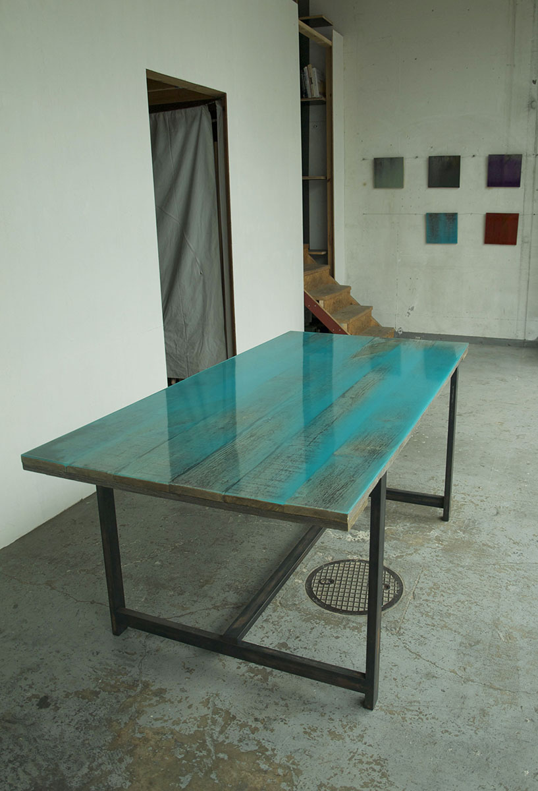

最初に挙げた、良いもののその理由はその意味は、というものの答えはでなかったが、作品を調べ、ゼミで先生と話す中で、良いと思うために必要な構成要素を考えるのとは逆に、良いと思ったものに付随する構成要素を探してみた。  

具体的に2つの例をあげると中山英之の「O邸」と、長坂常の「Flat Table」の2つを考えてみる。  

「O邸」では、四角形の平面に切妻、それに丸い平面を付け加えて屋根で切妻を曲げて連続させている。また、立面のプロポーションは、普通の妻側の立面とは違う。  

「Flat Table」の、表面が平らではない古材の天板を、取り替えたり製材し直したりせずに色つきのレジンで封入してしている。  
  

この2つは、一般的なカタチではないように見えるが、どこか気持ちの良い、心地よいものに見受けられる。カタチを決めるすべての構成則、構成要素を洗い出してそのなかで、部分的には当たり前から外すが、それ以外では、特殊な操作をしない。それによって、全体でみると心地の悪い奇妙さなどはないというカタチにたどりつけるのだろうかと考えた。  
藤本壮介のフリーハンドであったり常識にとらわれないとても自由なカタチであったりする、不思議さ、良い不自然さではなく、当たり前のカタチの延長で絶対的に気持ちの良いものがある。そして、それは当たり前のカタチの構成則構成要素を突き詰めた上で、少し遊んでみるのが良いのかと思った。  

私は、こんな面白いカタチがあるよと、まだ見ぬものを提案できるような才能はないので、設計の細部まで切り詰めていって、そこで、こっちを変えたらどうだろうか、あっちを変えたらどうだろうか、と、小さな部分から向き合って、良い作品を作っていきたいと思います。  
