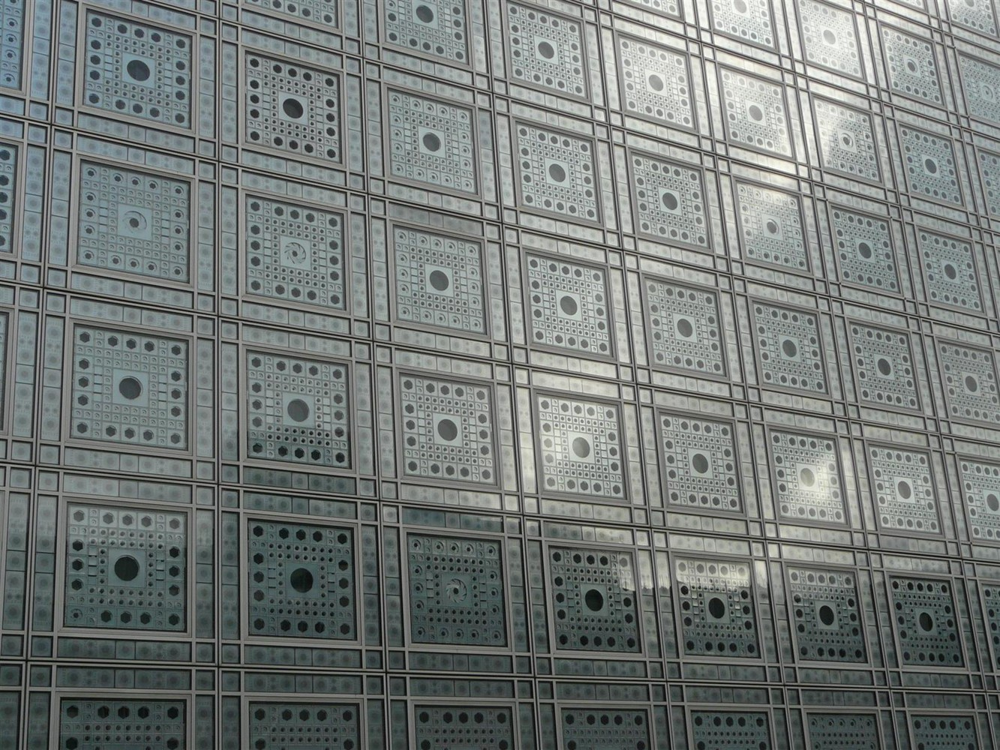
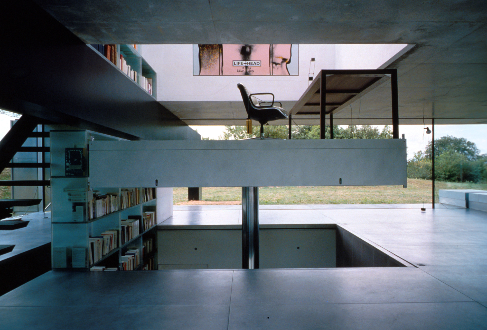
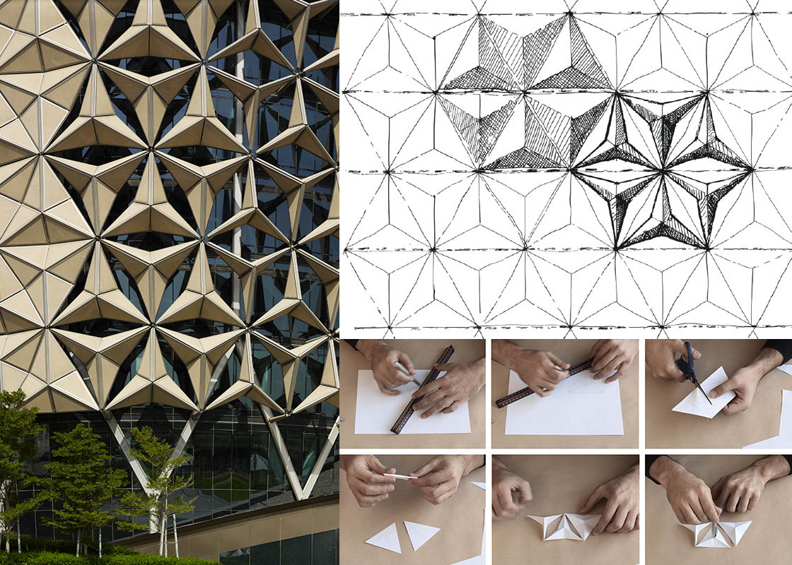
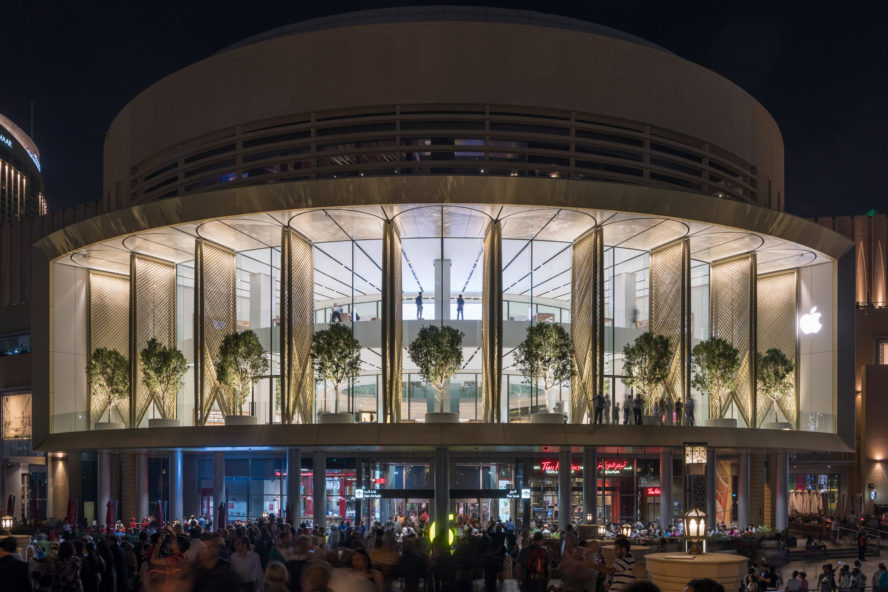
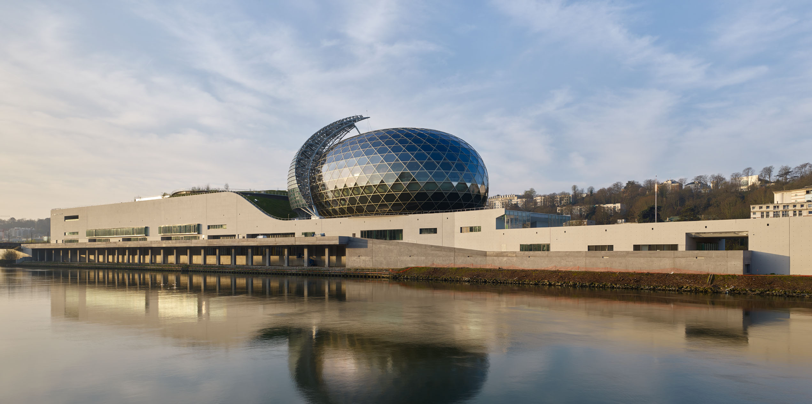
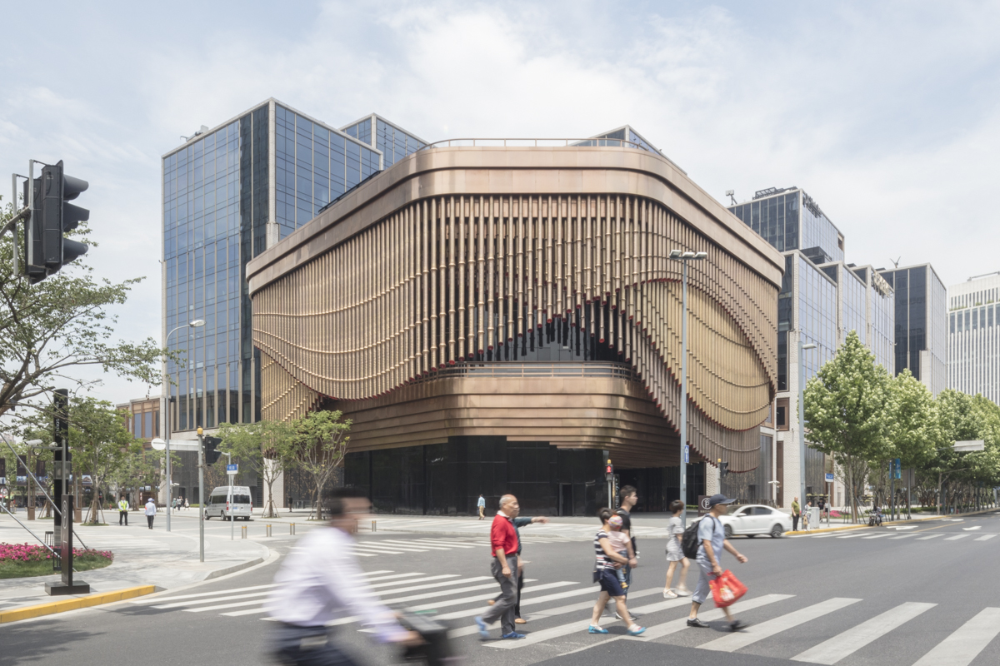
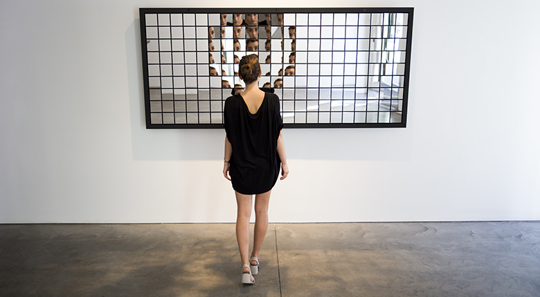
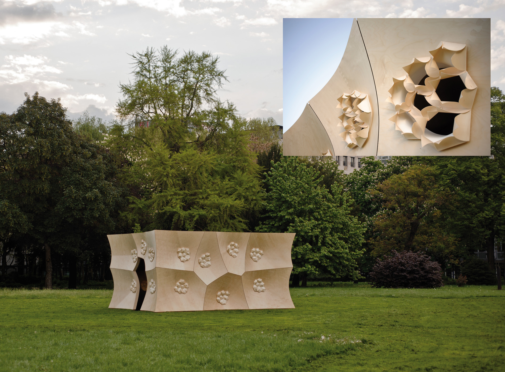
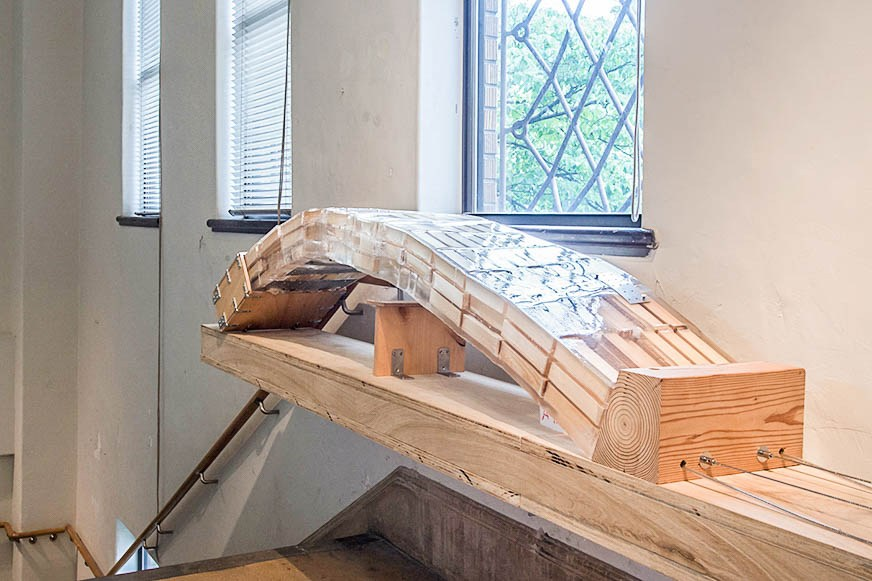

### 卒論やそれに関するサーベイを経て  

卒論（[https://github.com/naysok/graduation/blob/master/graduation.md](https://github.com/naysok/graduation/blob/master/graduation.md)）  

アルゴリズミックデザイン、アルゴリズムを用いた表現では、  
やりたい事や目指す形がまずイメージできていて、それを実装する、効率化させる、もしくは極めて大きく（小さく）スケールさせる、という点において、アルゴリズムを構築するというものは非常に有効である。  

その反面、やりたい事や目指す形を、アルゴリズムから導くというのは出来ない（このアルゴリズムの見た目が面白いから使ってみよ、みたいなことは一応可能であるが）と思った。  

完成イメージは、アルゴリズム云々の前にある程度で予測して、  
そこに向けての過程ではアルゴリズムは大きな力を発揮する。  
アルゴリズムを用いた生成であったり解析であったりは、完成イメージが正しいかどうかの検証であると考えられる。  

→ デザインに際して、アルゴリズムを組むこととは、つまり因果関係を見出し必要に応じて拘束すること。  

最終的な完成に向け、2つ
- Movable Interactive  
- 因果関係のモデリング、関係束のコンピューティング  

~~最終系の絵をできるだけ書かずに進めたい。サーベイの過程で特定のカタチに絞らずに~~

---  

因果性とは  
現在が未来を規定する「風が吹けば桶屋が儲かる」的な方向性、  
いわば局所的な因果関係の積み重ねで、全体的な結果が予測可能であるという考え方である。  

線形とは  
初期値（今の状態）が少し変わると、予測値（未来）もそれに応じて変わる  
法則性と（その表裏一体の概念としての）因果性  

---  

## Movable Interactive  

### Arab World Institute  
1987  
Jean Nouvel  

Facede  

  

[http://www.jeannouvel.com/en/desktop/home/#/en/desktop/projet/paris-france-arab-world-institut1](http://www.jeannouvel.com/en/desktop/home/#/en/desktop/projet/paris-france-arab-world-institut1)

### Maison a Bordeaux  
1998  
Rem Koolhaas  

EV  

[http://oma.eu/projects/maison-a-bordeaux](http://oma.eu/projects/maison-a-bordeaux)  

### Rolling Bridge  
2002  
Thomas Heatherwick  

Bridge  

  

[http://www.heatherwick.com/projects/infrastructure/rolling-bridge/](http://www.heatherwick.com/projects/infrastructure/rolling-bridge/)  
[（jump to MOV）](https://www.youtube.com/watch?v=x0Dj7XA77hw)  

### Al Bahar Towers  
2012  
AHR  

Movable Facade  

[http://www.ahr-global.com/Al-Bahr-Towers](http://www.ahr-global.com/Al-Bahr-Towers)
[http://www.archdaily.com/270592/al-bahar-towers-responsive-facade-aedas](http://www.archdaily.com/270592/al-bahar-towers-responsive-facade-aedas)

### Dubai Apple Store  
2017  
Norman Foster  

Facade, Window  

[https://www.dezeen.com/2017/05/02/apple-dubai-mall-foster-partners-architecture-carbon-fibre-shop-united-arab-emirates/](https://www.dezeen.com/2017/05/02/apple-dubai-mall-foster-partners-architecture-carbon-fibre-shop-united-arab-emirates/)  

### La Seine Musicale  
2017  
Shigeru Ban  

遮光の機能を持つ外殻  

  

[http://www.shigerubanarchitects.com/works/p31_IleSeguin/index.html](http://www.shigerubanarchitects.com/works/p31_IleSeguin/index.html)  

### Bund Finance Centre  
2017  
Thomas Heatherwick

moving veil  

[http://www.heatherwick.com/projects/buildings/bund-finance-centre/](http://www.heatherwick.com/projects/buildings/bund-finance-centre/)

---  

今のところ、センシングできる情報というのは、温度、湿度、日照など  
いずれは、生体データによるもっと人間に近い部分もセンシングできるようになるだろう。  

この温度、湿度、日照で作られるのが、上で挙げた、シャッター機構のジャン・ヌーベルのアラブや、折り紙の技術を転用したビルの開閉式の可動ファザードである。  

（建築）空間ということで考えると、  
この辺りのファザードを機械的に動かし環境をコントロールするタイプが多く、あまり可能性がないように思える。
ファザードの可動は、2次元的な処理であり、もう少し他の可能性がないこともない。  

ここでさらにこの先と考えられる可能性として  
住宅の躯体以外のインフィル、内装や間仕切り、ダブルスキン的なパオのようなシステムというものも考えられるかもしれない。  

レム・コールハースのボルドーの EV は、身体が悪い施主のための足であり、  
ヘザウィックの橋は船の通行に考慮した可動橋の一種である。  

---  

（建築）空間意外に目を向けると、キネティックスカルプチャーのようなもので、可動式のカプーアの多面鏡のような作品がある。  

### Fragments  
2016  
Random International  

computer vision  

[https://random-international.com/work/fragments/](https://random-international.com/work/fragments/)  

センシング（湿度、気温、人の位置、騒音等）されたものによって動くドローイングマシン。  

### SEMI-SENSELESS DRAWING MODULES  
2014  
yang02  

現実空間、情報空間でのフィードバックループ  

  

[http://yang02.com/works/sdm/](http://yang02.com/works/sdm/)

---  

## 因果関係のモデリング、関係束のコンピューティング  

物体や情報もこみこみで設計する。  
リアルな現実空間での、リアルな因果関係を見出す。

---  

~~Material Computing~~  

---  

### HygroSkin-Meteorosensitive Pavilion  
Achim Menges Architect, Oliver David Krieg , Steffen Reichert  
2013  

Material Computing  
Active Material  

  

[http://www.archdaily.com/424911/hygroskin-meteorosensitive-pavilion-achim-menges-architect-in-collaboration-with-oliver-david-krieg-and-steffen-reichert](http://www.archdaily.com/424911/hygroskin-meteorosensitive-pavilion-achim-menges-architect-in-collaboration-with-oliver-david-krieg-and-steffen-reichert)

### Active Shoes  
Christophe Guberan  
2015  

4D print  
Active Material  
マテリアルコンピューティング  

  

[http://www.christopheguberan.ch/Active-Shoes](http://www.christopheguberan.ch/Active-Shoes)

### PU  
木内俊克 + 砂山太一  
2013

壊れる瞬間のモデリング  
マテリアルコンピューティング  

[http://materializing.org/13_kwwek/](http://materializing.org/13_kwwek/)  

---

### ハシモト  

##### MF  

雨の中、裸足で踊りたい  
裸足=痛い  
雨に濡れる  

踊りにも歌詞大事  
歌詞を手で書いてみる  
身体化  

候補曲  
- 「banka」 野田洋次郎 （[https://www.youtube.com/watch?v=uJViETJ4mKg)](https://www.youtube.com/watch?v=uJViETJ4mKg)）  
- 「砂金」黒木渚 （[https://www.youtube.com/watch?v=Af5K-sgXZ_I](https://www.youtube.com/watch?v=Af5K-sgXZ_I)）  
- amazarashi  

歌詞  
曲として共感できるか  
踊りをつけやすいか  

video 作品 + ぞの場で  
video は一発撮り?  

rain room （random international）  
セルゲイ・ポルーニン  

##### MN  

ガンバスの側面にミラー  
それを芝生の上に置くと厚みが融ける  

ポスターは厚みがない  
絵画は厚みがある  

非ホワイトキューブ  

絵の置かれ方、空間性  

##### YK

鑓温泉  

ジェットバスなどは不要  
非レジャー施設  

純粋な湯、湯の楽しみ  

回転や売り上げ重視のレジャー施設NG  
遊びに X  
落ち着ける O  

