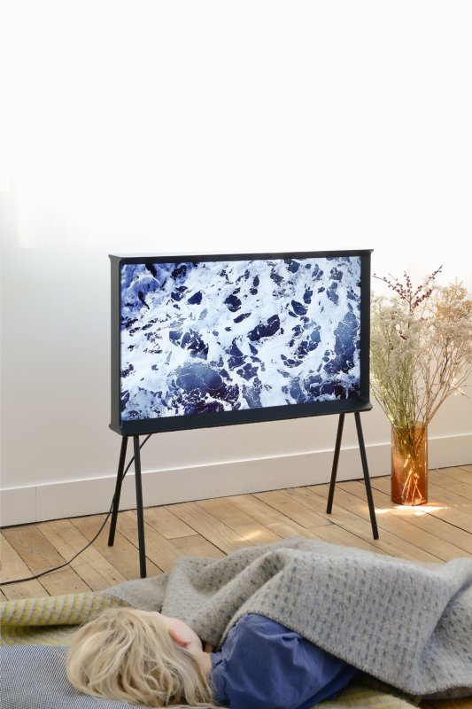
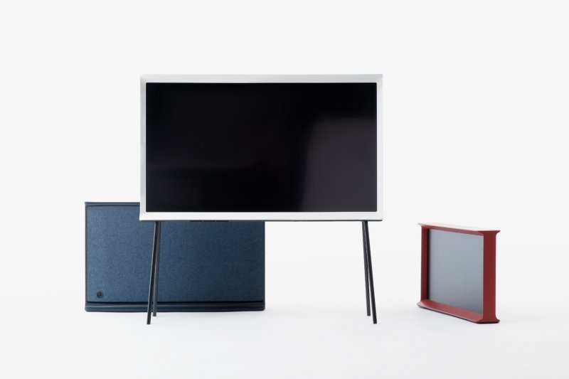

制作する中で考えること  
- what なにを  
- how（to） どのように  

what を考えるのが苦手？  
what を前提にしないで走る？  
what を他力本願にせず自分で決める  

how をひたすら積み上げて、その結果何らかの形で、収束させたい  
芸祭のあとの11/8までに、100個のネタを作る  

---  

---  

### ハシモトゼミ  

##### MH(171024)

上だけではなくて  
もっと下まで充填させる  
脚立に登ってみると充填されてるの体感できた  

密度感  
現状の5センチ角を、4センチに。  
3センチは小さすぎか  

アーチ、バラ園のアーチっぽさ、安っぽい  

四角形を45度回転で角で吊る  
四角形そのものだと、モザイク？ピクセル？  
文化祭感、キラキラ星感がちょっとある、白だから？  
丸はなんかあれだよね...  

照明計画は特になし。自然光の時間に  

場所について  
廊下全部から変更  
院生部屋の前からから見所になりそうな窓の広いところ、研究室前へ。資料室も  
その際に、階段や、EV 付近の端部のデザイン  

色の割合は均一で、ランダムに配置  
NTラシャ36色  
これは林が、色見本と現場で探した  

##### YK  

綱島でやる意味  
綱島再開発  
- apple の研究センター  
- 慶應の学生寮  
- 大きな駅ビル  
- アクセスが良くなる  

敷地  
元 ピーチゴルフ跡地  
綱島の桃  

具体的な施設として  
「おふろカフェ」  
サウナ、すぱ、仮眠  

お風呂カフェ  
風呂に入って、そのあとにパジャマでグダグダくつろげる  
[https://ofurocafe-utatane.com/](https://ofurocafe-utatane.com/)

アンチレジャー派  
アンチアミューズメント施設派の木村が何を言ってるの？？  

湯を嗜む施設は、ほったらかし温泉のような境地になってしまうのでデザインのしようがない  

これに対して、万人に湯を楽しんでもらえると考えた結果、おふろカフェのようなレジャー感覚  
湯上りの一杯みたいな楽しみを知ってもらう  

綱島の意味 or 自分のコンセプト  
綱島の意味 : 場所の可能性、場所の時代背景の面白さ  
コンセプト : 自分のやりたい温浴施設、自分の理想の湯の楽しみ  

中国の温泉施設「浅草」？  
お風呂に入ったり、バスケや陶芸などのレクレーションをしたり、1日遊べる  

湯の嗜みは、施設以外にも街の雰囲気が大きな部分を占めている（黒川温泉など）  
街全体の雰囲気もあって、到着して、湯に入って、帰るまで楽しい  
温泉街  

おふろカフェは、店内で完結、車で遊びに行くイオンみたいな  

その施設はどうゆう人が来るのか  

良いサービス、売れるサービス  
マーケティング、リサーチがすごい or 創業者の熱意がマジですごい  

##### MN  

何のためにその形  

ブルレック兄弟（仏のデザイナー）  
Ronan and Erwan Bouroullec
「Serif TV」2015  
脱テレビ、可愛い脚が付いている  

  
  

[http://www.bouroullec.com/?p=285](http://www.bouroullec.com/?p=285)

髙柳恵里 × 髙山陽介 × 千葉正也 展  
高山は自分の彫刻作品と向かい合ってもらうために、座る寝転がるためのカーペットを敷いている  

それぞれの絵にキャラ付け  
遠くから見て欲しい、明るい場所で見て欲しいetc...  
そのためのそれぞれのための什器、言い方を変えればそれぞれのための美術館  

絵を外に出しておいて、雨の日は絵も傘をさしていて、見に行く人も傘をさしていく？  

キャプション  
以前の展示で、知人にキャプションないの？と言われたこと有る  
絵の説明をしてしまうと、作者と鑑賞者は断絶  

