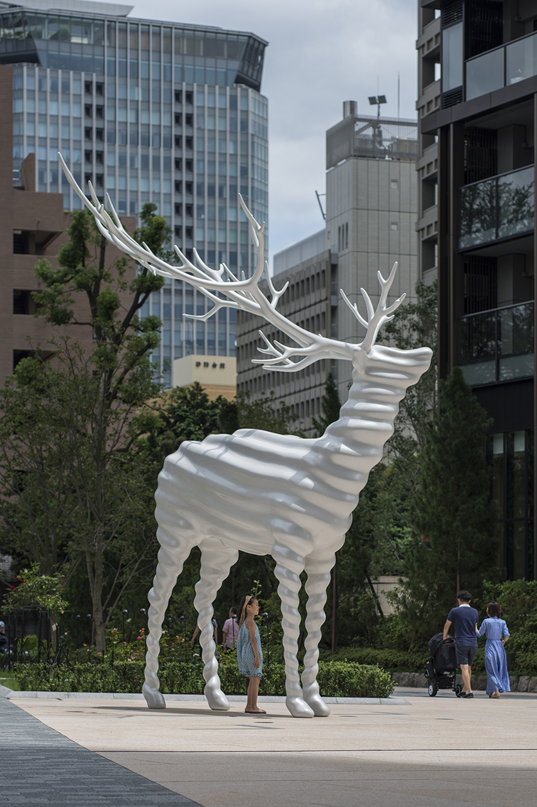

- モーフィング  
  - 「成長と形態 On Growth and Form」（ダーシー・トムソン D'Arcy Wentworth Thompson 1917）  
  - 海老のグリッドの変化により、環境とその個体の対応を示した  
  - 同様なことは鳥や魚にも言える  

  - 人間の生活にたいして空間がモーフィングすることってそもそも必要か。蝉は劇的な生活の変化と自身の変体するが人間は。リンのものについてはいろいろ考えることができる。（加戸先生）  

  

- 表面積計算、布の計算  
  - 単純に計算しやすい  
  - レーザー加工なので楽

- 物体の性質を計算 // これで
  - アクティブマテリアル、前にあげた靴  
  - マテリアルでのテンセグリティ的な  

  

- 名和晃平の鹿  
  - モーフィングの意味とかいろいろ言っているが、あれを見ると意味なんて吹っ飛ばして物として普通にめっちゃかっこいい  

  

---  

---  

### ハシモトゼミ  

##### YK  

自分だけの湯、別荘  
他者に伝えること = デザイン  
自分の理想を他の人に伝えてあげるような言い方大事  

誰のための風呂  
- 具体的に自分の家族  
- 自分の理想を他者のために提案してあげるつもりで  

##### MN  

それぞれの絵の分析、色の要素を取り出す  
その色で絵を置く場所をマッチング  

色だけではないかも  
色のみで繋がる？？  

絵の意味、他の何かで繋がる  
他の要素  

絵の表現の研究、パース、水平線  

家の中で見てもらうための小さな絵  
日常生活見て欲しいと言う気持ちが先にある、そのため大きさは小さめ  

書いた順番、意味  

描きたいと思うのは、色味や質感  

##### MH  

平面図、立面図書いて、施工の計画  

色は一時的に置かれているポスターのようなものは除外してピックした  
色の比率は均一  

きりっぱの端材で色の混在のスタディができた  

2万枚超え！！  

##### MF  

1人で2人分、知り合いに頼んで相方を  
パート分け、一部ユニゾン

曲編、3分14秒くらい  
ABCサビCCC  

メディアセンターチェック  

踊りの内容自分でなんとかなる  

それをどう見せるか  
スクリーン、場所、シンプルに？  
スポット光源 or 均質空間  

舞台 対 観客 の構図でなくても良い  

壁に投影でなくて、
ひも状のものが並ぶのスクリーンとし、それを通り抜けたりも出来る  

スクリーンないのダンサー と 自分 の構図、構成
