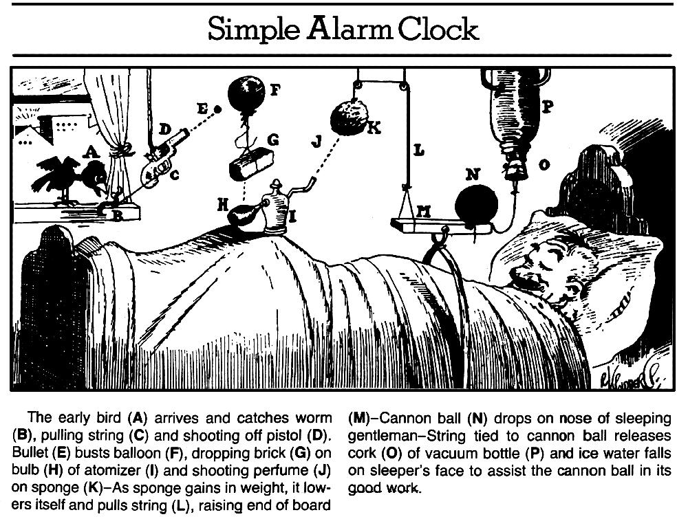

プロジェクタの2面出し+紙製の何か  

2つのアプリ  
どちらもモーフィングしている  

### A.app  

服っぽい何か  
紙  

カシミアのセーター  
ポリゴンの服  

パーソナルなスケール、1分の1  
パーソナルスペース、最小のシェルター  

↑↓ 全ては繋がらない相互通信  
通信によって一部で欠如する情報  

### B.app  

空間ぽい何か  
紙  
ギャラリーのモデリング  

リアルスケール  

・・・  

やぎさんゆうびん  
白ヤギさん、黒ヤギさん  

- 理由のあるかたち  
- 意味のなさ  
- 構造はある  

---  

### 山羊🐐

cf. ルーブ・ゴールドバーグ・マシン  

不確定な動きをする事物（猫や小鳥）をこう振る舞うんだろうなと信じることで理解できる、おまじないのような。  

>1910年代にアメリカの漫画家ルーブ・ゴールドバーグが考案した連鎖反応する機械的装置。機械としての有用性はほとんど重要ではなく、そこで主題とされるのは荒唐無稽でユーモラスな連鎖の妙である。今日では日本のTV番組『ピタゴラスイッチ』のなかで登場するピタゴラ装置のようなものが代表的な「マシン」として人口に膾炙している。ゴールドバーグが描いた漫画は、そうした装置とは異なる側面がある。例えば、漫画中にはアルファベットが付記され進行が逐次示されるだけではなく、絵の脇に装置に起こる出来事が文章で簡潔に説明される。それに加えて、人間やその他の生物が装置の一部としてほぼ必ず用いられ、それらが複数絡み合っているという特徴がある。漫画において連鎖反応は多くの場合、風、水、重力といった自然的要素によって、また生物の身体的な状態の変化あるいは食欲などの欲求などによって引き起こされてゆく。美術作品とこの装置との関連については、マルセル・デュシャンの《大ガラス》（1915-23）にこれと類似した装置の性格を読みとる研究がある。また、ルーブ・ゴールドバーグ・マシンとの類似性や影響関係を指摘することができる美術作品は、近年いくつも制作されている。フィシュリ＆ヴァイスの作品『事の次第』（85-87）はその代表的な例であり、日本においても泉太郎の作品群にこうした連鎖反応装置の要素を見出すことができる。  
(現代美術用語辞典ver.2.0 - Artscape より)  

作品の例  

A 鳥が来る  
B 鳥が芋虫を捕まえる  
C 糸が引かれる  
D ピストルが発射  
E 弾丸を  
F 風船が爆発  
G レンガが落ちる  
H バルブの上に  
I 香水容器の吹き付けの  
J 香水が吹き付けられる  
K スポンジに  
L スポンジが重みを持ち、糸を引く  
M ボードの端を持ち上げる  
N 砲丸が  
O 寝ている紳士の鼻に落ちる、砲丸と結ばれた糸がコルクを抜く  
P 真空ボトルの  
Q 冷たい水が寝ている人の顔にかかる  

  

ここで、鳥が芋虫を食べるという行為は、鳥次第的な感じであるが、それをそう思って進めていく  