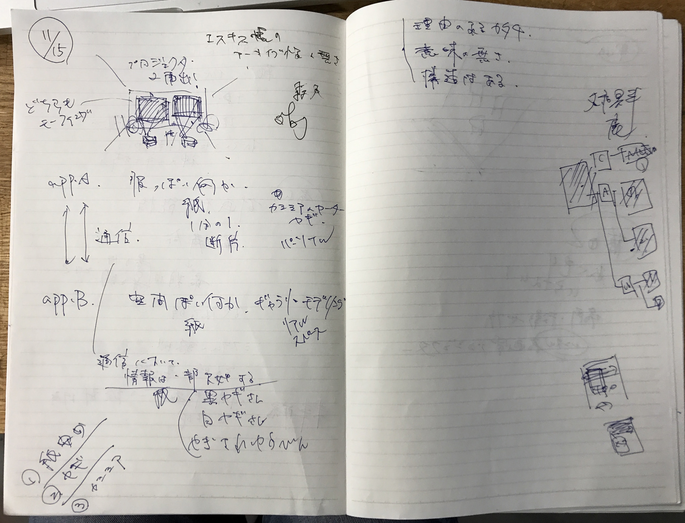

プロジェクタの2面出し+紙製の何か  

2つのアプリ  
どちらもモーフィングしている  

#### A.app  

服っぽい何か  
紙  

カシミアのセーター  
ポリゴン  

パーソナルなスケール、1分の1  
パーソナルスペース、最小のシェルター  

↑↓ 全ては繋がらない相互通信  
通信によって一部で欠如する情報  

#### B.app  

空間ぽい何か  
紙  
ギャラリーのモデリング  

リアルスケール  

やぎさんゆうびん  
白ヤギさん、黒ヤギさん  

- 理由のあるかたち  
- 意味のなさ  
- 構造はある  

