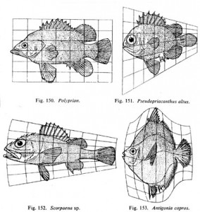
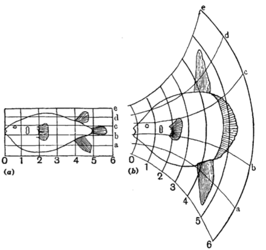
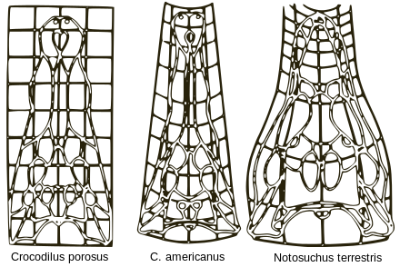

#### テキスト(171118)  

数理生物学者のダーシー・トムソンの On Growth and Form で示されるような、モーフィングと呼ばれる形状変換の手法がある。  

  

これを元に、グレッグ・リンは Embryological House という作品を発表した。  

  

しかし、リンの家がモーフィングするアニメーションと、トムソンの主張は、少し異なる。ここに図を示す。  

  

トムソンのモーフィングとは、異なる環境に住む同一の種をグリッドに配して、差異を比較したものだ。ここで比較される形状は、生物の進化の過程で時間とともに世代を経て、その環境に順応するために進化してきたその結果である。（紫色の矢印）  

しかし、リンは、同一のものが、異なる環境に対して、それが変化するというストーリーを作っている。（オレンジ色の矢印）  

建築的に、環境デザイン的に言えば、  
前者は、各地でその場の気候のような環境条件や、生活習慣に合わせて、様々なかたちに分化している建築、バナキュラー的な発展そのものである。  
リンが描いた、環境に対してリアルタイムに変化する建築と言うものは、ほとんど実装されていない。  

建築物は、環境の異なる場所に移動させるものではないので、建築の設計において考慮する、土地とその場所の環境、例えばカムチャッカ、メキシコ、ニューヨーク、ローマ、その土地に合わせてデザインすれば、その土地の環境の中で生活できるのである。  

リンの描いた、実際にモーフィングする、可動する空間として今回の作品を制作しました。

---  

---  

#### メモ(171118)  

ダーシー・トムソンの wikipedia より上2枚  
（[https://ja.wikipedia.org/wiki/%E3%83%80%E3%83%BC%E3%82%B7%E3%83%BC%E3%83%BB%E3%83%88%E3%83%A0%E3%82%BD%E3%83%B3](https://ja.wikipedia.org/wiki/%E3%83%80%E3%83%BC%E3%82%B7%E3%83%BC%E3%83%BB%E3%83%88%E3%83%A0%E3%82%BD%E3%83%B3)）

上から3枚目拾った  

上から4枚目、作成  

上から5枚目、Greg lynn  

  
  

  

  

