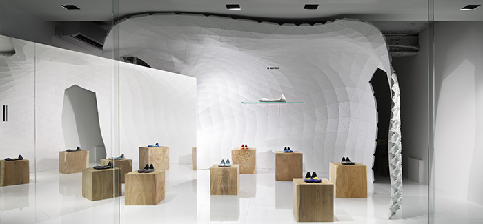

171121  
橋本先生ミーティング  

- ルーブゴールドバーグマシンとヤギ🐐  
- モーフィング  

### モーフィング  

環境に置ける変化量  
↓  
何かで吸収することで、身体に影響を与えないように  
衣服とインフィル  

身体 -（衣服）-（インフィル）- 建築躯体 - 外部環境  

変化量の分担  
ここの衣服、インフィルの割合は  
100 :   0  
80 : 20  
50 : 50  
0 : 100  
様々な可能性がある  

衣服  
ワンピースが風になびく画  
ブラウス  

インフィル  
中谷荘市の表参道の店舗デザイン  
  