### アルゴリズミックデザインと、建築設計について  

#### 1.はじめに  

コンピュータの上で、アルゴリズムを組むことでカタチを作る、いわゆるアルゴリズミックデザインに興味を持って制作に取り組んできた。アルゴリズムを組むこととは、構成則を指定し、部分部分を拘束していくことである。目指すカタチに向かってパズルのように組み上げていく作業は、できた時に心地よいので私は好きだ。逆に、これは不便なこともあり、こんな大きさでこんな感じの曲線でというように、と、手元の手帳と鉛筆に手遊びのように書き進めることができない。  
何かを目指してアルゴリズムを組む時に、私は今進めている手順が正しいものであるかということに気を配る。それと同時に、目指しているカタチが本当に良いものなのだろうか、と不安になる。  
この不安は、構成則を組むときに勝ち負けをどのように決めるのか、構成要素のパラメータをどうやって定めるのかわからないということによると思う。決定を下す時の、はっきりとした理由やわかりやすい意味というものがあるのだろうかとを、過去の事例を順番に見ていきながら考えていきたいと思う。  

本テキストでは、次の章で過去の事例を、建築以外のアルゴリズムを用いた表現活動と、建築設計におけるアルゴリズム的手法、それぞれを時代を追いながら挙げていき、最後の章で、それを踏まえての考察や自分の今後の制作への抱負へとつなげていく。  

___

#### 2.事例の調査  

アルゴリズムを用いた表現活動の歴史  

**1960年代**  
// コンピュータの活用が始まり、コンピュータを使った表現活動がおこりはじめる  

Patrick J. Hanratty  
「Design Automated by Computer（DAC）」(1961)  
General Motors 研究所に務める Hanratty 博士（のちに、CAD の父、と呼ばれるようになる）により、CAD の原型となるものが開発された。  

アイバン・ザザランド  
「Sketchpad」 (1963)  
ペンのような入力ツールを持つ、 CAD が開発される。  
[https://www.youtube.com/watch?v=USyoT_Ha_bA](https://www.youtube.com/watch?v=USyoT_Ha_bA)  

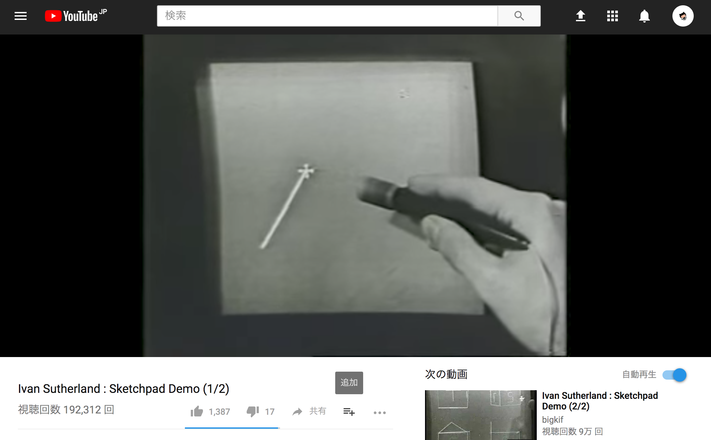  

川野洋  
「マルコフ・チェインの図形白黒」「Simulated Color Mosaic」  
元の作品群を認識する目、それを分析する脳、分析結果に基づいて新たな作品を作る手の3つの機能からなるKシステムを用いた表現活動を行う。

Computer Technique Group  
「Computer Design Series」他  

**1970年代**  
// 1977年、世界で最初の3D CAD「CATIA」が発売  

**1980年代**  
// 1982年、Autodesk 設立、AutoCAD のリリース  

Steven Lisberger（監督）  
「Tron」(1982)  
CG を用いて作られた最初の映画。この映画のために、Ken Perlin によって、パーリンノイズのアルゴリズムの開発された。  

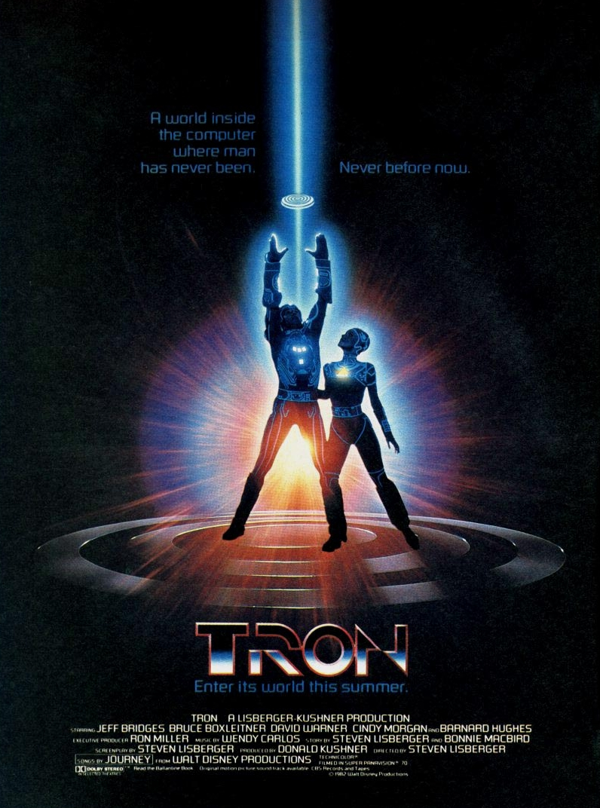

**1990年代**  
// Windows95 発売  

**2000年代**  
// 1990年代後半から2000年代にかけて、インターネットの発展及び、アーティストのためのプログラミング革命  
// デジタリズム。デジタル技術から素材や形式の解放。メタカルチャー、デジタルダダ  

アレクセイ・シュルギン  
「runme.org」  
コンピュータアートのポータルサイト  

ジョン前田  
「Design By Numbers」 // Processing の原型  
書く、動かす、インタラクトする  

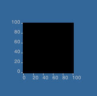  

**2010年**  
// 新たなマテリアルや相互の連動によって、情報空間と物理空間を、より近づけていこうという作品が見られる  
// 作品のテーマとして、詩や美学の追求から、環境ネットワークや人工知能、ロボティクス、マテリアルコンピューティングなどへシフトし始める  

Christophe Guberan  
「Active Shoes」（2015）  
4D print, Active Material, マテリアルコンピューティング  
[http://www.christopheguberan.ch/Active-Shoes](http://www.christopheguberan.ch/Active-Shoes)

  

yang02  
「SEMI-SENSELESS DRAWING MODULES」（2014）  
センシングされたデータに干渉されるドローイングマシン  
現実空間をセンシングし、情報空間で処理しドローイング、そのドローイングの様子を見る人間をセンシングする、これが繰り返され、現実空間と情報空間のフィードバックループする構造である。  

> 復数のモジュールがレールを左右に移動し、吊るされたペンが巻取り機によって上下運動を行い、壁面に抽象的な線を描画していく。レール上でモジュール同士が衝突すると、お互いそれまでとは逆方向に動き出す。上下の可動範囲は展示空間の人の多さや騒音量、その日の気温、湿度といった環境のコンディションによって、時間と共にゆるやかに変化していく。そうして描画機たちが自らが置かれる場と関係性を持ちながら、長い時間をかけて一つの巨大な抽象画を生成する。 抽象表現主義の多くの画家たちは自身の感情を表現し、行為の痕跡をキャンバスに定着させたと言われている。本作では環境の変化が画家の内面性に働きかけ、描く絵の質に影響を与えるとし、外界の状況をマシンの動き方に反映させることで、抽象画家そのものをシュミレートすることを試みた。画家の感情を左右する要因を取り入れることで、マシンによる表現はより豊かになりえるのだろうか。  

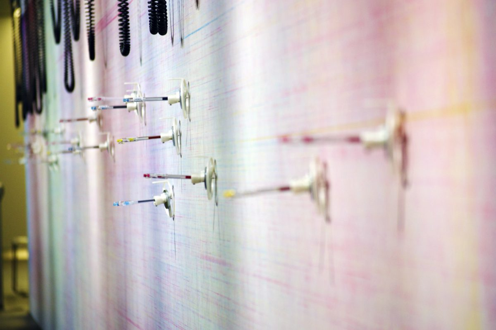  

___

建築設計におけるアルゴリズム的手法の歴史  

**1990年代**  
// Any 会議が開かれたのもこの10年間  

    Any 会議  
    建築と哲学を架橋する国際会議。中心人物は、ピーターアイゼンマン、磯崎新、イグナシ・デ・ソラ＝モラレス・ルビオの3人。+シンシア・C・デヴィッドソン（編集者）  
    主な参加者は、レム・コールハース、ベルナール・チュミ、ダニエル・リベスキンド、グレッグ・リン、アレハンドロ・ザエラ＝ポロなど。  
    ジャック・デリダ、ジョン・ライクマンなど、ジル・ドゥルーズの思想を継承する哲学者も参加した。  

グレッグ・リン  
「Embryological House」  
ジル・ドゥルーズや、アンリ・ベルクソンの哲学的な概念を応用し、有機的な、動的なモデルをコンピュータ上で構築した。  
また、器官主義という言葉を挙げ、差異や多様性の発生について述べている。そこでは、「成長と形態（ダーミー・トムソン 1917）」を参照し、異なる環境下の海老をグリッドに当てはめ、環境とその個体の対応を示した（いわゆる、モーフィング）。  
Embryological House は、粘土のようなものがモーフィングしていく過程で切断され、そのどの切断面でも家の形が作れるというアニメーションである。  

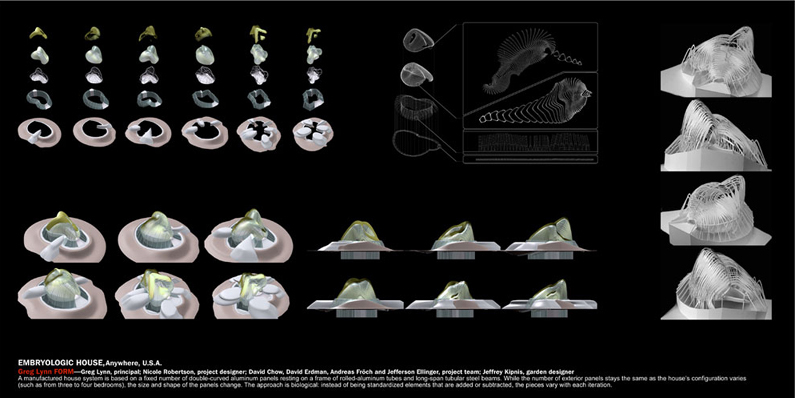

ベルナール・カッシュ  
「Objectile」  
デジタルデザインの、家具スケールのモデル生産プロセスを構築  

[http://www.archilab.org/public/1999/artistes/obje01en.htm](http://www.archilab.org/public/1999/artistes/obje01en.htm)  

**2000年代**  

渡辺誠  
「飯田橋駅」  
誘導都市という概念を掲げ、コンピュータ上で生成されたカタチを、解析をかけるなどで評価をした。  

> 誘導都市の基本的な構造は、おおむね次のようになっている。（これとは違うタイプのものもあるが）  
１－「価値基準」  
２－「評価プログラム」  
３－「発生プログラム」  
４－「接続」  
５－「生成」  

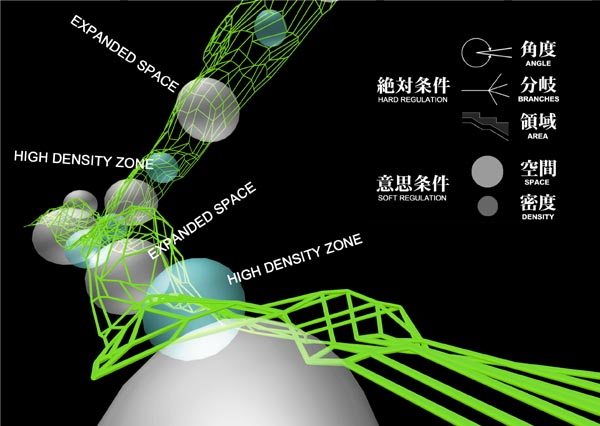
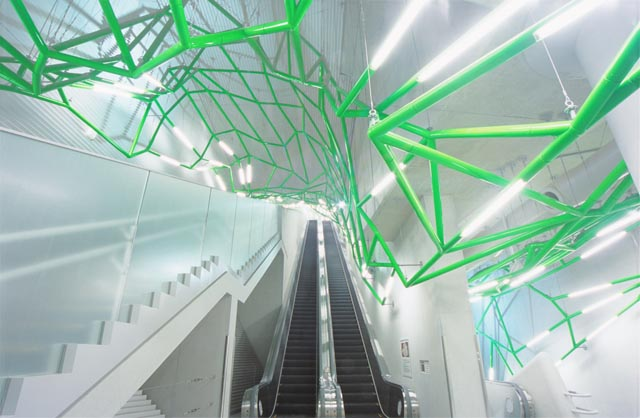

double Negatives Architecture  
「Corpora in Si(gh)te」  
現実空間のセンシングされた複数の情報が、仮想（情報）空間上にへ送られそこで、インタラクティブな構造物を生成される。  
これについては、従来の、人間と建築との関係性では、まず建築があって、その上で人間が自由に振る舞うので、現実のものとは少し違うといえる。  

> 「Corpora in Si(gh)te」では、YCAMを中心とした敷地全域 [館内、中央公園] に、多数のセンサーを付設したメッシュネットワークを形成し、リアルタイムの環境情報 [気温、明るさ、風向、音・ノイズetc.] を広範囲に収集・集積していきます。そのデータ解析をもとに、特殊な結節法則によって構造化される不可視の建築が、リアルタイムプロセッシングによって、館内・野外に生体のように成長または減退しながら生成されていくというプロジェクトです。  

> 生成ルール  
Corpora の生成ルールは、セルラオートマトン、ライフゲームなどの方法や思考をベースにしています。構造結節点は、各環境情報 (風に対する抵抗による方向、温度の高低による高さ方向の角度、明るさによる平面的な広がり、音・ノイズの大小による存在確立) によって変化させています。 同時に周囲との構造結節点を捉え、過密、過疎、自立の可能／不可などのケースを局所的に分析・判断し、部分が自己複製を行ったり、反対に自滅したりします。

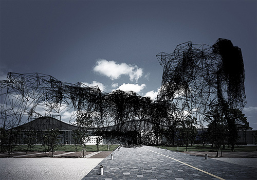  

**2010年代**  

松川昌平  
遺伝的アルゴリズムによる椅子  
応力や、施工の簡略さなどのルールのもと遺伝的アルゴリズムで最適化。  
TED等で見ると、松川は、気持ち悪いとかそういうものではなくて、ルールに則ったもの良しとしているように思える。  

これについて久保田先生にヒアリングしたところ（久保田先生は、松川とアルゴリズムを用いた表現活動について意見を交わしたことがあるとのこと）、松川は、自分は凡人であるので、まずは起こりうる可能性の列挙をすることを考えている、と言っているという。  
また、松川昌平＋慶応SFC松川研によるプリズミックギャラリーでの展示、「ARKHITEKTOME／アルキテクトーム 2015」では、生成された住宅が、コストや構造合理性、動線計画といった値によって評価され、それを親として遺伝的に評価値の高い住宅を作っていた。  
これらを見ても、松川は、絵や美としてのゴールではなく、数値として判断できるところを主として、研究をしているように見える。  
TED（[https://www.youtube.com/watch?v=tUaNzc2Ht4g](https://www.youtube.com/watch?v=tUaNzc2Ht4g)）  

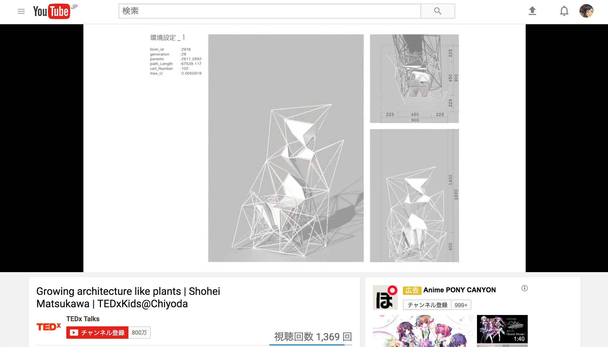  

Achim Menges Architect, Oliver David Krieg , Steffen Reichert  
「HygroSkin-Meteorosensitive Pavilion」（2013）  
Material Computing, Active Material  
[http://www.archdaily.com/424911/hygroskin-meteorosensitive-pavilion-achim-menges-architect-in-collaboration-with-oliver-david-krieg-and-steffen-reichert](http://www.archdaily.com/424911/hygroskin-meteorosensitive-pavilion-achim-menges-architect-in-collaboration-with-oliver-david-krieg-and-steffen-reichert)

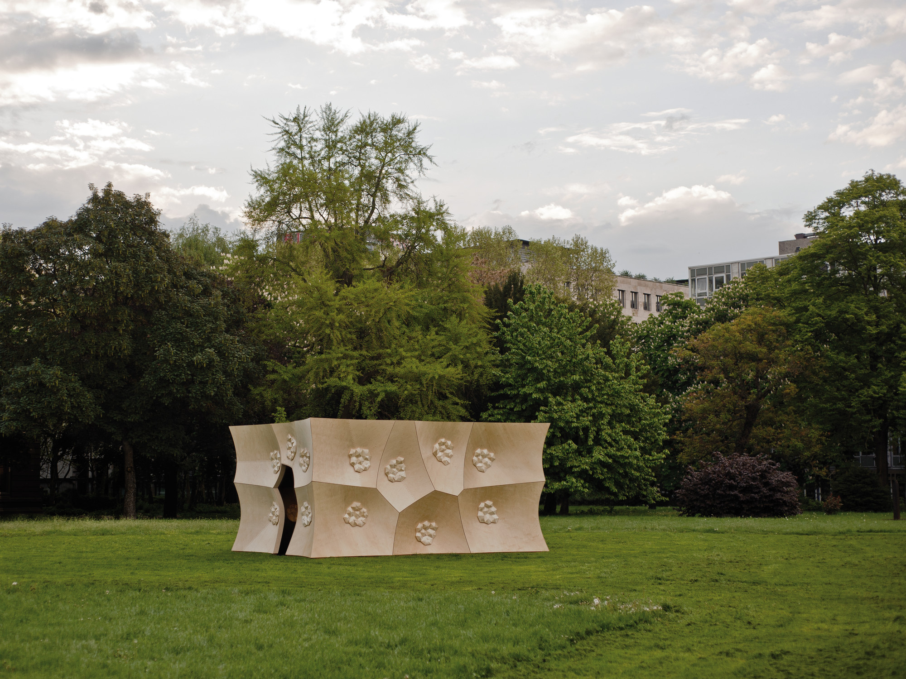  
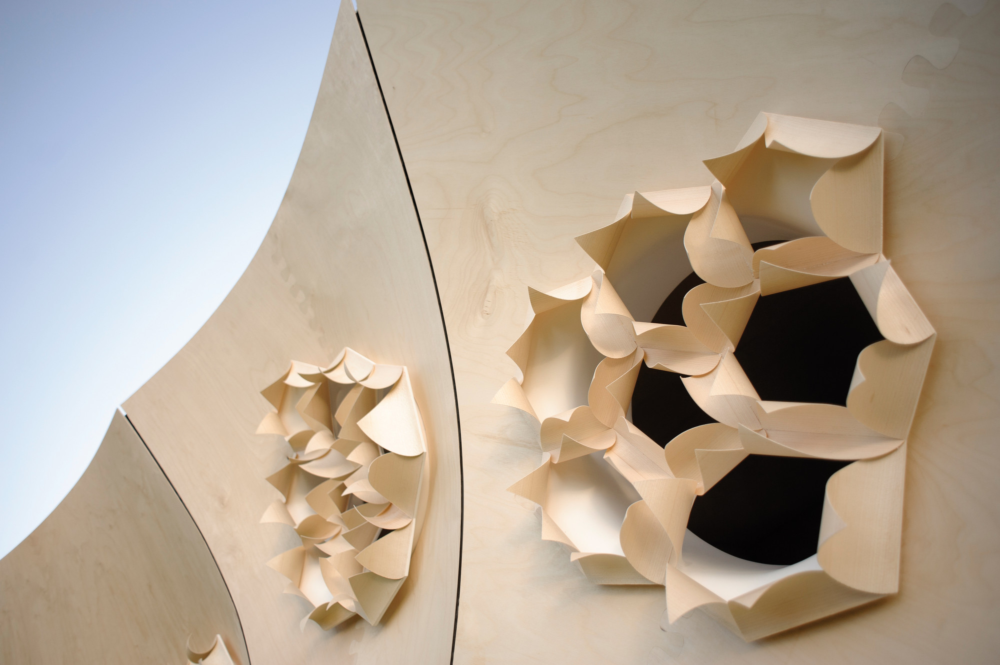  

___

#### 3.まとめ  

CTG 、ザザランドの時代のコンピュータは、まだまだとてもパワーが弱く、作業を楽にするためにコンピュータを使おうという次元ではなく、特に、 CTG は、日本IBM所有の大型計算機やプロッターを夜間に借りて使うしかないという状態であった。この時期の作品は、そこまで複雑ではなく、手の延長、場合によっては手にも劣る程度である。  

リン、カッシュの時代は、コンピュータのパワー不足、センシング等の技術の未熟さもあり、哲学や意味のついて話を進め、最後にアニメーションや、プロトタイプ的な部材を見せている。また、この2人はインテリアのスケールの実作はつくっているが、もっと大きなスケールでの、生成されたぬるっとしたカタチは作っていない。モーフィングするアニメーションなど、手では面倒なことをコンピュータにやらせているが、コンピュータは命令の通りに走っているだけである。  

渡辺、 dNA の時代になると、一定以上のマシンパワーがあり、解析であったり、現実空間から情報空間へデータを送ることだったりのコンピュータの操作が行われている。コンピュータを使ってこそできるようなものに近づいているように思える。  

Achim Menges 、yang02 、松川の時代になると、技術的な障壁は少なくなり、情報空間と現実空間の間でデータを介したフィードバックループや、遺伝的アルゴリズムでの形態最適化のようなことができるようになる。また、マテリアルそのものについても情報として扱うマテリアルコンピューテイングなどの分野の研究も進み、コンピュータがなければ作れないような作品が生まれた。  

最初の章であげた、良いもののその理由はその意味は、というものは、1990年代に盛り上がり、デリダや、ドゥルーズ、ライプニッツなど哲学思考をも巻き込んで進もうとしていた。しかし、デリダの脱構築などの概念を、（（全てはそうであるわけではないが）表象的な面で捉えて、または必要な一面だけを拝借して）建築設計や建築批評に引用したところで、哲学の側では論の発展には繋がらず、建築の側でも結局のところただ単に建築をうまく擁護しているように見せれればという感じでうまくいかずに、21世紀に入る頃には下火になったようだ。  
（要追記）

コンピュータの進化に合わせて、人間の作業も、COBOL を書くことから、意味を思考すること、マシンパワーを生かすための開発まで、変化し続けてきた。  
この1960年代から、2010年代まで追ってみて、2010年以降の情報集め利用することで生まれる作品の発生や、今、流行っているウェアラブルデバイスの生体情報のセンシングができるようになっていることなど、この辺りでの作品や、そのようになった時に生まれる空間とは、そういうことを考えていきたいと思った。  
（要追記）  

---

これについて掘り下げ、高度にセンシングされた未来の生活を考えてみると、センシングディストピアという言葉が浮かぶ。  
センシングされた情報や、それに基づき高度に進歩した人工知能により、朝起きた瞬間に、その日の気温や、予定に合わせた服が用意され、同様にきちんと考えられたメニューと量の食事が用意される。  
そして、職場に着くと、空調は完璧にコントロールされ、その日の予定に合わせて、席やしつらえが用意されている。  
人間は考えるという行為をしなくなり、建築というものもここで消えている。  
（のちほど追記します）

___

最後に  

前期から論文の準備をしている中で、人間はコンピュータに完全に追い抜かれた（特に囲碁はコンピュータにまだまだ追い抜かれないと一般的に言われていたが）というようなニュースが何度か流れてきた。  
囲碁では、2016年3月8日から15日にかけて、グーグルの囲碁AI「AlphaGo」と囲碁韓国チャンピオン・イ・セドルが戦い、AlphaGo の4勝1敗で終わった。そして、2017年5月23日、25日、27日に、グーグルの囲碁AI「AlphaGo」と、人類最強の棋士・柯潔との三番勝負が行われ、AlphaGo の3連勝であった。  
同様なことが将棋でも起こり、2017年の4月1日、5月20日に、コンピュータ将棋ソフト「Ponanza」と将棋名人・佐藤天彦叡王との将棋電王戦が開催され、Ponanza の2連勝であった。  
調べてみると、ゲームの数値が高ければ高いほど良い、それだけを教えてルールなどは特に教えない方法で、勝手に学んでいく（評価関数を作っていく）ような方法で強くなっていったようで、その結果、Ponanza は、人間が気持ち悪いな、定石外れで理解できない、が試合が進むと良い手だとわかるような指し回しをするという。  
点数が良かったものをひたすら学習していくコンピュータが、人間の持っている既成概念など知らずに、ひたすら繰り返すことで、人間の考えられなかった答えを見つけるというものから学べるのは、人間の今持っている既成概念は、本当に正しいのかはわからないということだ。近い将来には、（人間が頭で考えて行う仕事だと思っている）設計も、いつの間にかコンピュータに仕事を奪われてしまうのだろうかと思った。この辺りも継続して考えていきたい。  

___

参考文献  

久保田晃弘「コンピュータアートの今日的展開」（20世紀コンピュータアートの奇跡と展望展カタログ 多摩美術大学美術館 2006年）  
砂山太一「デジタルファブリケーションを有効化するための5ヵ条」（10+1 webサイト [http://10plus1.jp/monthly/2017/05/issue-03.php](http://10plus1.jp/monthly/2017/05/issue-03.php)）  
山本一成「人工知能はどのようにして『名人』を超えたのか？」（ダイヤモンド社 2017年）  
久保田晃弘「遙かなる他者のためのデザイン - 久保田晃弘の思索と実装」(BNN新社 2017年)  
磯崎新/浅田彰 監修「Anywise 知の諸問題」（NTT出版 1999年）  

最終更新  
171020